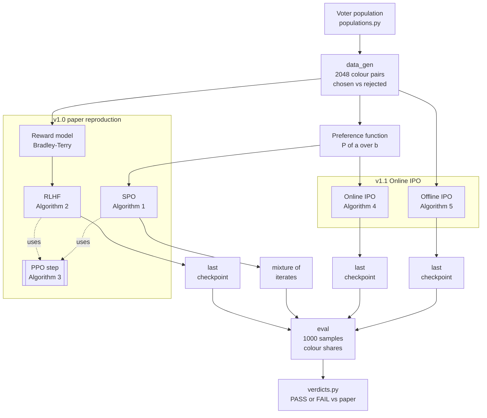

# Jackpot reproduction: overview

A walkthrough of how the [`jackpot-paper/`](../) reproduction works, with
links to the code. Line links point at the code as of `main` @ `6bbdbac`, which is tagged
`jackpot-paper/v1.1-online-ipo`. It has two parts, one per published version:

- **v1.0: paper reproduction** (sections 1 to 3): the paper's two methods, SPO and RLHF.
- **v1.1: Online IPO** (section 4): a second Maximal Lottery method added afterwards.

## Contents

- [How it fits together](#how-it-fits-together)
- [v1.0: paper reproduction](#v10-paper-reproduction)
  - [1. How SPO works](#1-how-spo-works)
    - [1.1 The preference data and the preference function](#11-the-preference-data-and-the-preference-function)
    - [1.2 The training loop: Algorithm 1](#12-the-training-loop-algorithm-1)
    - [1.3 The output is a mixture, not the last model](#13-the-output-is-a-mixture-not-the-last-model)
    - [1.4 Where we depart from A.8, and why](#14-where-we-depart-from-a8-and-why)
  - [2. How RLHF / PPO works: Algorithm 2](#2-how-rlhf--ppo-works-algorithm-2)
    - [2.1 Phase 1: the Bradley-Terry reward model](#21-phase-1-the-bradley-terry-reward-model)
    - [2.2 Phase 2: PPO against the reward model](#22-phase-2-ppo-against-the-reward-model)
    - [2.3 Where we depart from A.8, and why](#23-where-we-depart-from-a8-and-why)
  - [3. Understanding PPO](#3-understanding-ppo)
    - [3.1 A language model as a reinforcement-learning agent](#31-a-language-model-as-a-reinforcement-learning-agent)
    - [3.2 One `step`, end to end: Algorithm 3](#32-one-step-end-to-end-algorithm-3)
    - [3.3 Per-token rewards and the KL penalty](#33-per-token-rewards-and-the-kl-penalty)
    - [3.4 Advantages: GAE, and why γ matters so much here](#34-advantages-gae-and-why-γ-matters-so-much-here)
    - [3.5 Whitening: only relative scores matter](#35-whitening-only-relative-scores-matter)
    - [3.6 The clipped objective](#36-the-clipped-objective)
    - [3.7 How many gradient updates one step makes](#37-how-many-gradient-updates-one-step-makes)
    - [3.8 Settings: trl's defaults and ours](#38-settings-trls-defaults-and-ours)
- [v1.1: Online IPO](#v11-online-ipo)
  - [4. How Online IPO works](#4-how-online-ipo-works)
    - [4.1 The loss: regress log-ratio gaps onto preferences](#41-the-loss-regress-log-ratio-gaps-onto-preferences)
    - [4.2 One step, end to end: Algorithm 4](#42-one-step-end-to-end-algorithm-4)
    - [4.3 The output is the last iterate](#43-the-output-is-the-last-iterate)
    - [4.4 The offline-IPO control: Algorithm 5](#44-the-offline-ipo-control-algorithm-5)
    - [4.5 Settings and results](#45-settings-and-results)

## How it fits together

Every method starts from the same synthetic preference data and is judged the same way. They
differ only in how they turn preferences into a training signal. The pipeline's stages are
`data_gen → train → eval → plot`
([`runner.py` L11](../pipeline/runner.py#L11)), run once per population
(`majority`, `iia_2alt`, `iia_3alt`, `cyclic`) and per method.



How to read it:

- **Two kinds of input.** RLHF and offline IPO learn from the 2048 recorded pairs directly.
  SPO and online IPO never train on those pairs. They summarise them into the preference
  function P(a ≻ b) and then score the **policy's own fresh samples** against it at every step.
  That "online" scoring is what lets them find the Maximal Lottery.
- **PPO is shared machinery, not a method.** RLHF and SPO both hand a batch of scored answers
  to the same trl PPO step (section 3). They differ only in the score: a fixed reward-model
  value for RLHF, the win rate against the rest of the batch for SPO.
- **IPO drops PPO.** Both IPO variants are one squared-error loss with plain gradient steps.
  Online IPO uses the same P as SPO, so it is the second Maximal Lottery method. Offline IPO
  uses the same pairs as RLHF and, like RLHF, picks the Borda winner. It is there as a
  control to show that "online" is the ingredient that matters.
- **What gets evaluated.** SPO is judged on the mixture of all its iterates, because its last
  iterate orbits on cyclic preferences (section 1.3). The other methods are judged on their
  final checkpoint.

| Method | Learns from | Score / target | Optimiser | Output | Expected to find |
| --- | --- | --- | --- | --- | --- |
| RLHF | recorded pairs, via a reward model | fixed score per colour | PPO | last checkpoint | top-scoring colour (Borda-like) |
| SPO | P(a ≻ b) + fresh samples | win rate against the batch | PPO | mixture of iterates | Maximal Lottery |
| Online IPO | P(a ≻ b) + fresh samples | pairwise target (P − ½)/τ | plain gradient | last checkpoint | Maximal Lottery |
| Offline IPO | recorded pairs | pairwise target 1/(2τ) | plain gradient | last checkpoint | Borda winner |

## v1.0: paper reproduction

The paper's two methods, SPO and RLHF, as reproduced in tag `jackpot-paper/v1.0-replication`.

### 1. How SPO works

SPO (Self-Play Preference Optimisation) is how the paper trains a policy toward the
**Maximal Lottery**. The Maximal Lottery is the distribution over alternatives that no other
distribution beats in a pairwise majority vote. You don't train a reward model. You play the
model against itself: a sampled answer is rewarded by how often the population prefers it
over the model's other answers.

The whole implementation is
[`pipeline/stages/train_spo.py`](../pipeline/stages/train_spo.py), which is
104 lines and runs on shared PPO code in
[`pipeline/stages/train_common.py`](../pipeline/stages/train_common.py).

#### 1.1 The preference data and the preference function

**The four populations.**
[`populations.py` L24-53](../pipeline/populations.py#L24-L53) defines the
four voter populations. For example, `majority` is 2 voters ranking R > G > B and 3 voters
ranking B > R > G.

**The training data.**
[`data_gen.py` L20-33](../pipeline/stages/data_gen.py#L20-L33) builds 2048
examples. For each one it picks two distinct colours at random, picks a voter, and records
which colour that voter prefers as `{chosen, rejected}`.

**The preference function.** `empirical_preference`
([`populations.py` L56-84](../pipeline/populations.py#L56-L84)) turns those
examples into `P(a, b)`, the fraction of examples preferring a over b. It follows the edge
rules in the paper's Appendix A.8:

- a tie scores 0.5;
- if only one of the two colours appears in the data, that colour wins (1.0);
- if neither appears, it scores 0.5.

SPO only ever reads this function. It never sees a reward model. The contrast with RLHF:

- **RLHF** ([`train_rlhf.py`](../pipeline/stages/train_rlhf.py)) first fits a
  single score per colour, a Bradley-Terry reward model.
- **SPO** works directly from the pairwise preferences, so it can represent a cycle such as
  R > G > B > R, where no single score per colour fits.

#### 1.2 The training loop: Algorithm 1

At a high level, SPO is the paper's Algorithm 1:

```
Algorithm 1  Self-Play Preference Optimisation (SPO)
Input:  preference function P(a ≻ b), initial policy π₁, prompt x,
        iterations T, batch size k
for t = 1, …, T do
    sample answers  y₁, …, y_k ~ π_t(· | x)
    for i = 1, …, k do
        r_i ← 1/(k−1) · Σ_{j≠i} P(y_i ≻ y_j)        ▷ win rate against the batch
    end for
    π_{t+1} ← PPO update of π_t on rewards r₁, …, r_k
end for
Return: uniform mixture of π₁, …, π_T
```

Our implementation adds two things from A.8 that the pseudocode leaves out: 10% of each batch is
replaced by forced colour words (step 4 below), and PPO carries a small KL pull toward the base
model (section 1.4).

The loop is at
[`train_spo.py` L83-99](../pipeline/stages/train_spo.py#L83-L99). Each step
does the following.

1. **Sample from the current policy.** `generate_responses`
   ([`train_common.py` L50-57](../pipeline/stages/train_common.py#L50-L57))
   samples 128 completions of the one fixed prompt, `…A: My favourite color is the color`.
   It uses plain sampling at temperature 1 with no top-k or top-p (`GEN_KWARGS`,
   [`train_common.py` L47](../pipeline/stages/train_common.py#L47)), so it
   sees the policy's true distribution. Responses are up to 8 new tokens long.

2. **Parse each answer to a colour.** `parse_colour`
   ([`evaluate.py` L16-22](../pipeline/stages/evaluate.py#L16-L22)) takes the
   first colour word in the text, or `None` if there isn't one.

3. **Record the samples for the output mixture.** `mixture.observe(policy_parsed)` runs at
   [`train_spo.py` L91](../pipeline/stages/train_spo.py#L91).
   Section 1.3 explains why.

4. **Swap in forced colours for exploration.** At
   [`train_spo.py` L92-96](../pipeline/stages/train_spo.py#L92-L96), 10% of
   the batch (`uniform_colour_fraction` × 128, so 12 samples) is replaced by a single token
   `" red"`, `" blue"` or `" green"`, chosen uniformly (A.8: "10% of the batch is a uniform
   sample of the three colour words"). This keeps every colour appearing in the batch even
   after the policy has stopped producing it. Without the swap, a colour that dies out could
   never get a reward and never come back.

5. **Score each sample against the others.** `preference_rewards`
   ([`train_spo.py` L22-42](../pipeline/stages/train_spo.py#L22-L42)) is the
   formula from Algorithm 1:

   r_i = 1/(k−1) · Σ_{j≠i} P(a_i ≻ a_j)

   Each sample's reward is its average win rate against the other 127 samples in the same
   batch. The batch is the opponent, which is where "self-play" comes from. An unparseable
   sample (`None`) counts as a colour missing from the data, so it loses to every named
   colour and scores 0 against them. This pushes the model to keep answering in the right
   format.

6. **Take one PPO update.** `trainer.step(queries, responses, rewards)` runs at
   [`train_spo.py` L98](../pipeline/stages/train_spo.py#L98). The trainer is
   trl 0.10.1's `PPOTrainer`, built in `make_ppo_trainer`
   ([`train_common.py` L29-44](../pipeline/stages/train_common.py#L29-L44)).
   The policy is Gemma with a LoRA adapter and a value head (`build_ppo_policy`,
   [`train_common.py` L11-26](../pipeline/stages/train_common.py#L11-L26)).
   There is no separate reference model. trl gets reference log-probs by switching the
   adapter off, which means the KL penalty anchors the policy to the base model.

**Why this finds the Maximal Lottery.** Take the `majority` population. Here
P(B ≻ R) = 0.6, P(B ≻ G) = 0.6 and P(R ≻ G) = 1.0. Whatever mix the batch currently holds, a
blue sample wins more than half its comparisons on average, so PPO shifts probability toward
blue. A red sample against a mostly-blue batch scores only about 0.4.

**Why it settles at 0.5.** Write u(c) for the win rate of colour c against the current mix π,
u(c) = Σ_c' π(c') · P(c ≻ c'). Because P(a ≻ b) + P(b ≻ a) = 1, the mix's own average win rate
is exactly 0.5: Σ_c π(c) · u(c) = 0.5. PPO raises the probability of samples that scored above
the batch's expected reward and lowers it for those below (the advantage is reward minus a
baseline, section 3.4), so a colour with u(c) > 0.5 gains probability and one with u(c) < 0.5
loses it. The mix stops moving only when every colour it still plays has u(c) = 0.5, and no
colour it has dropped has u(c) > 0.5, since that colour would be pulled back in (the forced
10% colours keep it in the batch to be seen). That is the Nash condition of the symmetric
game: no colour beats the mix by more than a tie. Equivalently, π is a lottery that no
alternative beats in a pairwise majority vote, which is the definition of the Maximal Lottery.

This shows only that the Maximal Lottery is a **fixed point** of the training dynamics, not
that training reaches it. Gradient play can circle the fixed point instead of settling into it,
and does on `cyclic`, which is why SPO returns the mixture of iterates (section 1.3). The KL
pull toward the base model also moves the fixed point slightly. The equilibria are:

- for `majority`, all blue (blue is the Condorcet winner, the colour that beats every other
  head to head);
- for `cyclic`, each pair splits 2/3 against 1/3, and the equilibrium is uniform, about 1/3
  each.

Training runs 30 epochs × (2048 / 128) = 16 steps per epoch, so 480 PPO steps in total
([`train_spo.py` L79-81](../pipeline/stages/train_spo.py#L79-L81)).

#### 1.3 The output is a mixture, not the last model

Algorithm 1 ends with "Return: uniform mixture of π₁…π_T", the average of every intermediate
policy. This matters most on cyclic preferences. There, plain gradient play tends to
**orbit** around the equilibrium: red gives way to blue, blue to green, green back to red.
The last policy can be anywhere on that orbit, but the time-average is close to the
equilibrium. [`scripts/spo_simplex_sim.py`](../scripts/spo_simplex_sim.py)
demonstrates this on CPU.

Keeping 480 LoRA adapters would be wasteful. `MixtureAccumulator`
([`train_common.py` L124-159](../pipeline/stages/train_common.py#L124-L159))
relies on the fact that, for one fixed prompt, the mixture's output distribution is just the
average of the iterates' output distributions. So it adds up the colour counts from every
step's sampled batch. It is fed the batch **before** the forced swap, because the forced
tokens are not draws from the policy.

The accumulated result is written to `mixture.json`
([`train_spo.py` L100](../pipeline/stages/train_spo.py#L100)). The
evaluation stage attaches it to the ML cell's results
([`evaluate.py` L118-127](../pipeline/stages/evaluate.py#L118-L127)), so the
verdicts judge the mixture. The sampled checkpoint is judged separately.

Two related points:

- **Which checkpoint is saved.** The separate checkpoint is chosen by `CheckpointGate`
  ([`train_common.py` L168-215](../pipeline/stages/train_common.py#L168-L215)).
  It keeps the last checkpoint taken while most of the model's outputs still parsed as
  colours, because PPO sometimes drifts into gibberish.
- **Shared bookkeeping.** `TrainingLoop`
  ([`train_common.py` L218-271](../pipeline/stages/train_common.py#L218-L271))
  handles metrics, sample logs and the per-epoch distribution rows for the figures, for both
  SPO and RLHF.

#### 1.4 Where we depart from A.8, and why

These overrides are at
[`configs/experiments.yaml` L19-25](../configs/experiments.yaml#L19-L25):

| Setting | A.8 value | Ours | Reason |
|---|---|---|---|
| `gamma` (discount factor) | 0.0 | **1.0** | See the note below the table. This was the costliest bug in the reproduction. |
| `vf_coef` (value-function weight) | 0.0 | 0.01 | Once γ = 1 the value head has to be trained, or the policy orbits. |
| `init_kl_coef` (pull toward the base model) | 0.0 | 0.02 (`majority`: 0.01) | A small pull keeps the output parseable. |
| `mini_batch_size` | 32 | 8 × 4 gradient accumulation | Same effective batch, fits in GPU memory. |
| `ppo_epochs` (passes over each batch) | trl default 4 | 2 | Halved for cost. |

**The γ = 0 bug.** trl places the whole score on the **last** token of the response. The
colour is the **first** token (` red`, followed by `.` and so on). The score reaches the
colour token only after being discounted once per token in between, so by γᵏ. At γ = 0 that
is zero, and the preference signal never reached the colour choice. We read A.8's "Gamma
patience: 0.0" as PPO's γ. That reading may be wrong, since the line may have meant
something else. The full story is in
[`results/reproduction_report.md`](reproduction_report.md).

**Entropy coefficient.** A.8 says the entropy coefficient was "increased to ensure
exploration" but gives no value. We don't set one. The 10% forced colours and the KL anchor
do the exploration work instead
([`configs/paper_hparams.yaml` L27](../configs/paper_hparams.yaml#L27)).

### 2. How RLHF / PPO works: Algorithm 2

RLHF is the baseline the paper argues against. It has two phases:

1. **Reward model.** Fit one score per answer from the pairwise preference data (a
   Bradley-Terry model).
2. **PPO.** Train the policy to produce high-scoring answers, with a KL penalty that keeps
   it close to the base model.

SPO (section 1) reuses the same PPO machinery. The only differences are where the reward
comes from and what the method returns:

| | RLHF | SPO |
| --- | --- | --- |
| Reward for an answer | a fixed score from a learned reward model | its win rate against the policy's other answers, which changes as the policy changes |
| Can express a cycle (R > G > B > R)? | no: one number per colour always gives a strict order | yes: it reads the pairwise preferences directly |
| What it converges to | the top-scoring colour, softened only by the KL penalty | the Maximal Lottery |
| Returned policy | the final checkpoint | the uniform mixture of all iterates |

The implementation is
[`pipeline/stages/train_rlhf.py`](../pipeline/stages/train_rlhf.py)
(171 lines). It uses the same PPO scaffolding in
[`train_common.py`](../pipeline/stages/train_common.py) as SPO.

At a high level:

```
Algorithm 2  RLHF with a Bradley-Terry reward model and PPO
Input:  preference data D = {(x, y_w, y_l)}, initial policy π₁, reference π_ref = π₁,
        KL coefficient β, iterations T, batch size k
                                                       ▷ Phase 1: reward model
fit r_φ by minimising  E_D[ −log σ(r_φ(y_w) − r_φ(y_l)) ]
                                                       ▷ Phase 2: PPO
for t = 1, …, T do
    sample answers  y₁, …, y_k ~ π_t(· | x)
    for i = 1, …, k do
        s_i ← r_φ(y_i)                                 ▷ fixed score, no opponent
    end for
    π_{t+1} ← PPO update of π_t on scores s₁, …, s_k, with KL penalty β toward π_ref
end for
Return: π_T
```

Compared with Algorithm 1, the score comes from a fixed model instead of the batch, and the
method returns the last policy instead of a mixture.

#### 2.1 Phase 1: the Bradley-Terry reward model

**The model.** Bradley-Terry assumes each answer y has a hidden score r(y), and that the
probability a voter prefers y₁ over y₂ is σ(r(y₁) − r(y₂)), where σ is the logistic
function. Fitting the model means finding scores that make the observed choices as likely
as possible. Training minimises

  −log σ(r(chosen) − r(rejected)) + c · (r(chosen) + r(rejected))²

over the 2048 examples. The second term is trl's `center_rewards_coefficient`: it pulls the
scores toward zero on average, so they don't drift. The paper sets c to 0.01.

**How it's built.** `train_reward_model`
([`train_rlhf.py` L18-57](../pipeline/stages/train_rlhf.py#L18-L57)):

- The backbone is Gemma with a one-number classifier head in place of the next-token head
  (`build_seq_cls`,
  [`models.py` L82-98](../pipeline/models.py#L82-L98)). It gets its own LoRA
  adapter ([`models.py` L101-110](../pipeline/models.py#L101-L110)).
- Each example becomes a pair of full texts, `prompt + " blue."` (chosen) and
  `prompt + " red."` (rejected)
  ([L25-33](../pipeline/stages/train_rlhf.py#L25-L33)).
- trl's `RewardTrainer` trains it for 3 epochs, using A.8's settings and trl defaults
  otherwise ([L40-55](../pipeline/stages/train_rlhf.py#L40-L55)).

**Recording what it learned.** After training, `canonical_rm_scores`
([L77-86](../pipeline/stages/train_rlhf.py#L77-L86)) scores the three
canonical answers and writes them to `rm_scores.json`
([L141-142](../pipeline/stages/train_rlhf.py#L141-L142)). This file is the
most useful diagnostic in the RLHF arm, because it shows the reward model's ranking directly.

**Why the reward model behaves like a Borda count.** A Borda count ranks alternatives by
total pairwise wins, which is not the same as winning every head-to-head contest. On the
`majority` population, blue wins both of its contests 3:2, so blue is the Condorcet winner.
But red beats green 5:0, while blue beats green only 3:2. One score per colour can't
satisfy all three results, and the lopsided red-over-green result dominates the fit. The
scores we measured on Gemma are red 0.73 > blue 0.27 > green −0.89. That makes red the top
answer, as the paper predicts: red is the Borda winner. The same effect produces the
paper's other RLHF failures:

- **IIA (independence of irrelevant alternatives) flip.** With only red and blue, blue
  scores first. Add green, an option nobody wants, and red overtakes blue, because red's
  unanimous win over green lifts its score. Blue's preference over red hasn't changed.
- **Cyclic population.** The three scores come out within 0.05 of each other, so which
  colour ends up on top is close to arbitrary.

These measurements are in
[`results/reproduction_report.md`](reproduction_report.md)
("Two mechanisms, measured directly").

#### 2.2 Phase 2: PPO against the reward model

The loop is at
[`train_rlhf.py` L156-167](../pipeline/stages/train_rlhf.py#L156-L167). Each
step does the following.

1. **Sample.** It samples 16 completions of the fixed prompt, up to 8 tokens each, using the
   same `generate_responses` as SPO
   ([`train_common.py` L50-57](../pipeline/stages/train_common.py#L50-L57)).
   There are no forced-uniform colours: RLHF has no exploration mechanism beyond sampling at
   temperature 1.

2. **Score.** `rm_scores`
   ([`train_rlhf.py` L97-115](../pipeline/stages/train_rlhf.py#L97-L115))
   reduces each response to the colour in its first sentence (`first_sentence`,
   [L71-74](../pipeline/stages/train_rlhf.py#L71-L74)). The reward is the
   reward model's score for that colour's canonical answer, `prompt + " <colour>."`. A
   response naming no colour gets a fixed floor, `unparsed_reward`
   ([L89-94](../pipeline/stages/train_rlhf.py#L89-L94)): the worst
   canonical score minus the gap between best and worst. That way, every real colour beats
   no answer by at least the preference gap. Section 2.3 explains why the raw sampled text
   isn't scored instead.

3. **Update.** `trainer.step(queries, responses, rewards)`
   ([L162](../pipeline/stages/train_rlhf.py#L162)) calls trl 0.10.1's PPO,
   the same trainer as SPO (`make_ppo_trainer`,
   [`train_common.py` L29-44](../pipeline/stages/train_common.py#L29-L44)).
   Inside `step`, trl does four things:
   - It builds a reward for every response token. Each token gets
     −β · (log π(token) − log π_ref(token)), a penalty for moving away from the base model.
     The last token also gets the reward-model score. The KL coefficient β is
     `init_kl_coef`. As in SPO, the reference π_ref is the base model with the LoRA adapter
     switched off.
   - It estimates each token's advantage (how much better the outcome was than the value
     head expected) with GAE. RLHF runs at γ = 1, trl's default
     ([`config.py` L57](../pipeline/config.py#L57)), so the score does
     reach the colour token.
   - It takes clipped policy-gradient steps plus a value-head loss weighted by `vf_coef`,
     over `ppo_epochs` passes of the batch.

4. **Log.** `after_step`
   ([L165-167](../pipeline/stages/train_rlhf.py#L165-L167)) records the
   parse rate, colour distribution and KL, plus a per-colour mean reward
   (`reward_by_colour`,
   [`train_common.py` L93-102](../pipeline/stages/train_common.py#L93-L102)).
   The per-colour reward is what exposed the bug described in section 2.3.

**What PPO converges to.** With a KL penalty of weight β, the best policy has a closed form:

  π*(colour) ∝ π_base(colour) · exp(r(colour) / β)

As β → 0 this becomes the argmax: all mass on the top-scoring colour. With the KL penalty
it is the base model's distribution, tilted toward the reward model's favourite. Either way
it can only amplify the reward model's order. It can't produce a deliberate lottery.

Training runs 2 epochs × (2048 / 16) = 128 steps per epoch, so 256 PPO steps in total
([L153-155](../pipeline/stages/train_rlhf.py#L153-L155)).

**Output.** The output is a single policy: the checkpoint kept by `CheckpointGate`
([`train_common.py` L168-215](../pipeline/stages/train_common.py#L168-L215)),
the last one saved while its outputs were still mostly parseable. There is no
`mixture.json`. The evaluation stage samples 1000 answers from that checkpoint, and the
verdicts judge RLHF cells on those samples.

#### 2.3 Where we depart from A.8, and why

The overrides are in
[`configs/experiments.yaml` L26-37](../configs/experiments.yaml#L26-L37).
They are layered on A.8's values by `train_params`
([`config.py` L29-90](../pipeline/config.py#L29-L90)): first A.8, then the
`rlhf` overrides, then the per-cell overrides.

| Setting | A.8 value | Ours | Reason |
|---|---|---|---|
| `init_kl_coef` (β, pull toward the base model) | 0.0 | 0.2 (`iia_2alt`: 0.1, `cyclic`: 0.05) | With no anchor, PPO reaches the answer by step 6. It then keeps pushing an already-maxed-out reward until the model emits nothing parseable. |
| `epochs` | 4 | 2 | Same stability reason: 256 steps end while generation is still healthy. |
| `learning_rate` | 5e-4 | 1e-4 | Same. |
| `mini_batch_size` | 16 (the whole batch) | 8 × 2 gradient accumulation | Same effective batch, fits in GPU memory. |
| Reward on a sampled response | not described | the reward-model score of the canonical answer for the colour named, with a floor for no colour | See below. |

**Scoring the canonical answer instead of the sampled text.** The reward model only ever
saw texts shaped like `prompt + " <colour>."`. PPO's samples look like
`" red.\n\nQ: What does the…"`. Scored on that raw text, the reward followed the untrained
continuation after the colour rather than the colour itself. At step 1, blue paid −1.69 and
red +0.63, although the reward model ranked blue first by 0.50. So PPO optimised the
continuation, and the two-option cell went red under every anchor. Reducing each response
to its colour leaves PPO one lever, the colour token. That is the same information SPO's
reward uses, which also keeps the comparison between the two methods fair. The docstring at
[`train_rlhf.py` L97-107](../pipeline/stages/train_rlhf.py#L97-L107) records
this, and the reproduction report lists it as issue 3.

### 3. Understanding PPO

Both arms train the policy with the same routine: one call per step to trl 0.10.1's
`PPOTrainer.step(queries, responses, scores)`
([`train_spo.py` L98](../pipeline/stages/train_spo.py#L98),
[`train_rlhf.py` L162](../pipeline/stages/train_rlhf.py#L162)). Our code
decides *what the score is*. Everything after that happens inside trl. This section opens
that box. trl links point at the library's source at the `v0.10.1` tag, the version the
paper and this repo use.

PPO stands for Proximal Policy Optimisation (Schulman et al., 2017). In one sentence: make
the sampled answers that scored better than expected more likely, but only by a bounded
amount per update, so one noisy batch can't wreck the policy.

#### 3.1 A language model as a reinforcement-learning agent

PPO is a reinforcement-learning algorithm, so the first step is to frame generation in
reinforcement-learning terms:

| Term | Here |
| --- | --- |
| Policy π_θ | Gemma plus the LoRA adapter. θ are the adapter's weights, the only ones trained. |
| State s_t | The prompt plus the response tokens generated so far. |
| Action a_t | The next token. There are about 256k choices, Gemma's vocabulary. |
| Episode | One response: up to 8 tokens, or fewer if the model emits end-of-sequence. |
| Reward | Our score (win rate for SPO, reward-model score for RLHF), given once at the end of the episode, plus a small KL penalty on every token (section 3.3). |
| Value V(s_t) | The expected total future reward from state s_t. A **value head** estimates it: a single linear layer on Gemma's last hidden state, with dropout 0.1 ([`modeling_value_head.py` L22-59](https://github.com/huggingface/trl/blob/v0.10.1/trl/models/modeling_value_head.py#L22-L59)). `AutoModelForCausalLMWithValueHead` adds it to the policy ([`train_common.py` L11-26](../pipeline/stages/train_common.py#L11-L26)). |
| Reference π_ref | The base model: the same network with the adapter switched off. |

In our task only one action really matters: the first token, the colour. The later tokens
(`.`, `\n\nQ: …`) matter only because they can break the answer's format.

#### 3.2 One `step`, end to end: Algorithm 3

The "PPO update" line in Algorithms 1 and 2 expands to:

```
Algorithm 3  One PPO step (trl's PPOTrainer.step)
Input:  policy π_θ with value head V, reference π_ref, batch of answers y₁, …, y_k with
        scores s₁, …, s_k, KL coefficient β, discount γ, GAE λ, clip ε, passes E
for each answer i and token t do
    record  log π_old(a_t | s_t),  V_old(s_t),  log π_ref(a_t | s_t)      ▷ no gradients
    r_t ← −β · (log π_old − log π_ref)  +  [t is last] · s_i              ▷ per-token reward
end for
compute advantages Â_t with GAE(γ, λ) from r and V_old; whiten  across the batch
repeat E times
    for each shuffled mini-batch do
        ρ_t ← π_θ(a_t | s_t) / π_old(a_t | s_t)
        L ← −mean min(ρ_t Â_t, clip(ρ_t, 1−ε, 1+ε) Â_t)  +  c_v · value loss
        take one Adam step on L
    end for
end repeat
```

`PPOTrainer.step`
([`ppo_trainer.py` L648-890](https://github.com/huggingface/trl/blob/v0.10.1/trl/trainer/ppo_trainer.py#L648-L890))
receives a batch of responses already sampled by our code
([`train_common.py` L50-57](../pipeline/stages/train_common.py#L50-L57)),
with one score each. It then does the following:

1. **Record the old policy.** A forward pass without gradients over prompt plus response
   gives, for every response token, log π_old(a_t | s_t) and the value estimate V(s_t).
   "Old" means the policy that generated the batch. It stays fixed for the rest of the step.
2. **Record the reference.** The same forward pass with the LoRA adapter disabled gives
   log π_ref(a_t | s_t) (`optional_peft_ctx`,
   [L749-756](https://github.com/huggingface/trl/blob/v0.10.1/trl/trainer/ppo_trainer.py#L749-L756)). There is no second copy of Gemma in
   memory.
3. **Build per-token rewards.** The KL penalty on every token, plus the score on the last
   token (section 3.3).
4. **Estimate advantages.** How much better each token turned out than the value head
   expected, with GAE (section 3.4). Then normalise them across the batch (section 3.5).
5. **Optimise.** Run `ppo_epochs` passes over the batch, each in shuffled mini-batches.
   Every mini-batch recomputes log π_θ and V with gradients, then takes a gradient step on
   the clipped policy loss plus the weighted value loss (section 3.6), using Adam at the
   configured learning rate.

The batch is then discarded. PPO is *on-policy*: the next step samples fresh responses from
the updated policy.

#### 3.3 Per-token rewards and the KL penalty

`compute_rewards`
([`ppo_trainer.py` L1104-1140](https://github.com/huggingface/trl/blob/v0.10.1/trl/trainer/ppo_trainer.py#L1104-L1140))
builds a reward for every response token t:

  r_t = −β · (log π_old(a_t | s_t) − log π_ref(a_t | s_t)), plus the score if t is the last token

- **The KL term.** The bracket is a one-sample estimate of the KL divergence, a measure of
  how far the policy has drifted from the base model (`_kl_penalty` with the default
  `kl_penalty="kl"`,
  [L1142-1156](https://github.com/huggingface/trl/blob/v0.10.1/trl/trainer/ppo_trainer.py#L1142-L1156)).
  It is positive when the policy has made a token more likely than the base model did.
  So every token pays a small fee for drifting away from the base model.
- **β** is `init_kl_coef`. We set `adap_kl_ctrl=False`
  ([`train_common.py` L39](../pipeline/stages/train_common.py#L39)), so β
  stays fixed. trl's default would adapt it toward a target KL of 6 nats.
- **The score** lands on the **last** response token only. That is the root of the γ story
  in the next section.

With β = 0, as in A.8, nothing pulls the policy back toward the base model. That is how
our first runs reached the answer by step 6 and then kept pushing until the output
degenerated (section 2.3).

#### 3.4 Advantages: GAE, and why γ matters so much here

The policy gradient needs to know, for each token, whether choosing it turned out better
or worse than expected. That quantity is the **advantage** A_t. trl estimates it with
generalised advantage estimation (GAE)
([`compute_advantages`, L1158-1184](https://github.com/huggingface/trl/blob/v0.10.1/trl/trainer/ppo_trainer.py#L1158-L1184)),
working backward from the last token:

  δ_t = r_t + γ · V(s_{t+1}) − V(s_t)    (with V = 0 after the last token)
  A_t = δ_t + γλ · A_{t+1}

- **δ_t, the one-step surprise.** The reward just received, plus the discounted value of
  where the token led, minus what the value head expected before choosing it.
- **A_t, the advantage.** It adds up the surprises from t to the end, each discounted by a
  further factor of γλ.
- **The "returns"** A_t + V(s_t) are the targets the value head is trained toward.

trl's defaults are γ = 1 and λ = 0.95
([`ppo_config.py` L83-85](https://github.com/huggingface/trl/blob/v0.10.1/trl/trainer/ppo_config.py#L83-L85)).

**Where the score reaches the colour.** Take a 4-token response, ` red` `.` `\n` `Q`.
Positions run t = 0 to 3, and the score sits in r_3:

| Token | Its advantage contains the score with weight |
| --- | --- |
| ` red` (t = 0) | (γλ)³ |
| `.` (t = 1) | (γλ)² |
| `\n` (t = 2) | γλ |
| `Q` (t = 3) | 1 |

At γ = 1 the colour token receives 0.95³ ≈ 0.86 of the score, and the value head's
estimates enter as a baseline. At **γ = 0 the weight is 0**. The
colour token's advantage becomes r_0 − V(s_0): the KL fee minus a value estimate, with no
trace of the preference. That is why every SPO run at A.8's γ = 0 wandered. It is pinned on
trl's own code by
[`test_gamma_zero_severs_score_from_colour_token`](../tests/test_gamma_credit.py#L56-L61)
and
[`test_gamma_one_delivers_score_to_colour_token`](../tests/test_gamma_credit.py#L63-L66).

The same arithmetic shows why a **one-token** response would make γ irrelevant. The colour
is then the last token, so the score lands on it directly. That is the alternative reading
of A.8 in the peer review's major issue 4.

At γ = 1 the value head also matters. Every δ_t includes V(s_{t+1}), so an untrained head
(A.8's `vf_coef` = 0) adds noise that drifts from step to step. That is why we train it
with `vf_coef` 0.01
([`test_trained_value_head_removes_bootstrap_noise_from_advantages`](../tests/test_gamma_credit.py#L78)).

#### 3.5 Whitening: only relative scores matter

Before the update, trl **whitens** the advantages: it subtracts their mean and divides by
their standard deviation, over every token of the whole batch (`masked_whiten`,
[`ppo_trainer.py` L1182](https://github.com/huggingface/trl/blob/v0.10.1/trl/trainer/ppo_trainer.py#L1182)).
This has three consequences for us:

- **Constant shifts vanish.** Adding a constant to every score changes nothing. SPO's
  rewards sit around 0.5 and RLHF's around 0; only the differences within a batch matter.
- **Small spreads get scaled up.** On the cyclic RLHF cell the reward model's three scores
  are within 0.03 of each other. Whitening still turns them into advantages of ordinary
  size, so PPO commits to the top colour as firmly as it would with a wide spread. That is
  why that cell reached red 16 of 16 by step 128 on a margin of 0.02.
- **Relative size still counts.** Whitening rescales everything by the same factor, so the
  balance between the score and the KL fee is unchanged. β still sets how far the policy
  may move. Likewise, the unparsed floor still sits only 0.065 below red on that cell
  (peer-review response, M5).

#### 3.6 The clipped objective

For each token in a mini-batch, the **probability ratio** compares the current policy with
the one that generated the batch:

  ρ_t = π_θ(a_t | s_t) / π_old(a_t | s_t)

At the start of each step ρ = 1. As the updates proceed, ρ moves away from 1.
The policy loss
([`loss`, L1186-1273](https://github.com/huggingface/trl/blob/v0.10.1/trl/trainer/ppo_trainer.py#L1186-L1273))
is

  L_policy = mean over tokens of max(−A_t · ρ_t, −A_t · clip(ρ_t, 1 − ε, 1 + ε)),  ε = `cliprange` = 0.2

Read it case by case:

- **A_t > 0, a better-than-expected token.** The loss rewards raising ρ, but only until
  ρ = 1.2. Beyond that the clipped term wins the max and the gradient is zero. One batch
  can't make a good token more than 20% more likely.
- **A_t < 0, a worse-than-expected token.** Lowering ρ helps only down to 0.8.
- **The pessimistic max.** Taking the worse of the two terms means clipping only ever
  removes incentive; it never adds any. This is PPO's cheap stand-in for a trust region, a
  hard limit on how far one update may move the policy.

The **value loss** trains the value head toward the returns. It is clipped the same way
(`cliprange_value` = 0.2), so V can't jump more than 0.2 away from its old estimate:

  L_value = ½ · mean(max((V_θ − R)², (clip(V_θ, V_old ± 0.2) − R)²))

The loss backpropagated is **L_policy + `vf_coef` · L_value**. Both flow into the shared
LoRA weights as well as the value head, which is why a large `vf_coef` can disturb the
policy and a zero `vf_coef` leaves V untrained.

Two further details:

- **A safety valve.** If a mini-batch's mean ratio exceeds `ratio_threshold` (10), trl
  zeroes its loss and warns.
- **No entropy term.** trl 0.10.1's PPO loss has no entropy bonus. Entropy is computed only
  as a logged statistic. A.8's "entropy coefficient increased to ensure exploration" has
  nothing to attach to in this trainer, which is one more reason we don't set one (section
  1.4).

#### 3.7 How many gradient updates one step makes

Each mini-batch's gradients accumulate, and Adam steps once per `mini_batch_size ×
gradient_accumulation_steps` samples. The optimiser step on every mini-batch is a no-op
until accumulation completes, which `accelerate` handles
([`train_minibatch`, L1059-1102](https://github.com/huggingface/trl/blob/v0.10.1/trl/trainer/ppo_trainer.py#L1059-L1102)).

| | SPO | RLHF |
| --- | --- | --- |
| Samples per step (`batch_size`) | 128 | 16 |
| Samples per Adam update (mini-batch × accumulation) | 8 × 4 = 32 | 8 × 2 = 16 |
| Passes over the batch (`ppo_epochs`) | 2 | 4 (trl default; not overridden) |
| Adam updates per step | 128 / 32 × 2 = **8** | 16 / 16 × 4 = **4** |
| Steps | 480 | 256 |
| Adam updates in total | 3,840 | 1,024 |

All the updates in a step use the same sampled batch. That is why the clipping in section
3.6 matters. Without it, eight updates on one batch of 128 answers could overfit that
batch's luck.

#### 3.8 Settings: trl's defaults and ours

Defaults from
[`ppo_config.py` L69-125](https://github.com/huggingface/trl/blob/v0.10.1/trl/trainer/ppo_config.py#L69-L125).
Ours are set in `make_ppo_trainer`
([`train_common.py` L29-44](../pipeline/stages/train_common.py#L29-L44))
from `train_params`
([`config.py` L29-90](../pipeline/config.py#L29-L90)).

| Setting | What it controls | trl default | SPO | RLHF |
| --- | --- | --- | --- | --- |
| `learning_rate` | Adam step size | 1.41e-5 | 1e-4 | 1e-4 |
| `init_kl_coef` (β) | per-token KL fee | 0.2 | 0.02 (`majority` 0.01) | 0.2 (`iia_2alt` 0.1, `cyclic` 0.05) |
| `adap_kl_ctrl` | adapt β toward a target KL | True | False | False |
| `gamma` (γ) | discount in GAE | 1 | 1.0 | 1.0 |
| `lam` (λ) | GAE bias/variance trade-off | 0.95 | 0.95 | 0.95 |
| `cliprange` (ε) | policy ratio clip | 0.2 | 0.2 | 0.2 |
| `cliprange_value` | value clip | 0.2 | 0.2 | 0.2 |
| `vf_coef` | weight of the value loss | 0.1 | 0.01 | 0.01 |
| `ppo_epochs` | passes over each batch | 4 | 2 | 4 |
| `whiten_rewards` | whiten rewards before GAE (advantages are always whitened) | False | False | False |
| `max_grad_norm` | gradient clipping | None | None | None |

## v1.1: Online IPO

A second Maximal Lottery method added after the paper reproduction, from experiment 0086
(tag `jackpot-paper/v1.1-online-ipo`).

### 4. How Online IPO works

Online IPO (Calandriello et al. 2024, arXiv:2403.08635) is a second way to train toward the
Maximal Lottery. It is not in the Jackpot paper. It was suggested in feedback on the
reproduction and tried in experiment 0086, and it is now a method of the pipeline alongside
`rlhf` and `ml` (SPO). Like SPO it needs no reward model and reads the pairwise preferences
directly. Unlike SPO it needs no PPO and no mixture of iterates:

| | SPO (section 1) | Online IPO |
| --- | --- | --- |
| Training signal | a reward per answer: its win rate against the batch, fed to PPO | a target per **pair** of answers: how often the population prefers one over the other |
| Optimiser machinery | trl's PPO: value head, GAE, clipping | one squared-error loss, plain PyTorch |
| Pull toward the base model | a per-token KL fee (`init_kl_coef`) | built into the loss through τ |
| Returned policy | the uniform mixture of all iterates | the **last iterate** |

The implementation is
[`pipeline/stages/train_ipo.py`](../pipeline/stages/train_ipo.py) (328
lines). It runs two methods: `ipo`, the online method, and `ipo_offline`, a control that
shows why "online" is the part that matters (section 4.4). The runner sends both to it
([`runner.py` L33-34](../pipeline/runner.py#L33-L34)).

#### 4.1 The loss: regress log-ratio gaps onto preferences

For an answer y, let d(y) = log π(y) − log π_ref(y), how much more likely the policy makes y
than the base model does. For a pair of answers, IPO wants the gap d(y₁) − d(y₂) to equal
(P(y₁ > y₂) − ½) / τ. An answer the population prefers 80% of the time should end up with a
log-ratio 0.3 / τ above its rival; a tie should end up with no gap at all. τ sets how far
from the base model the policy may move. A smaller τ means larger targets and a sharper
policy.

- **Targets.** `pair_targets` ([`train_ipo.py` L46-56`](../pipeline/stages/train_ipo.py#L46-L56)) fills a k × k matrix of
  (P(cᵢ > cⱼ) − ½) / τ for the batch, using the same preference function as SPO
  (section 1.1). `pair_preference` ([`train_ipo.py` L34-43`](../pipeline/stages/train_ipo.py#L34-L43)) adds SPO's rule for answers that name no
  colour: they lose to any named colour and tie with each other.
- **Loss.** `online_ipo_loss` ([`train_ipo.py` L59-72`](../pipeline/stages/train_ipo.py#L59-L72)) is the mean squared error between dᵢ − dⱼ and
  the target over every pair i < j of the batch, so a batch of 128 gives 8,128 pairs.
- **Reference.** As in SPO and RLHF, π_ref is the same model with the LoRA adapter switched
  off ([`train_ipo.py` L103-111`](../pipeline/stages/train_ipo.py#L103-L111)).

The minimiser of this loss is the Nash equilibrium of the τ-regularised preference game
(Proposition 4.1 of the IPO paper). As τ shrinks, that equilibrium approaches the Maximal
Lottery.

#### 4.2 One step, end to end: Algorithm 4

At a high level, following Calandriello et al. (2024):

```
Algorithm 4  Online IPO
Input:  preference function P(a ≻ b), initial policy π₁, reference π_ref = π₁, prompt x,
        regularisation τ, iterations T, batch size k
for t = 1, …, T do
    sample answers  y₁, …, y_k ~ π_t(· | x)
    for i = 1, …, k do
        d_i ← log π_t(y_i | x) − log π_ref(y_i | x)
    end for
    L ← mean over pairs i < j of  ( d_i − d_j − (P(y_i ≻ y_j) − ½) / τ )²
    π_{t+1} ← one gradient step of π_t on L
end for
Return: π_T                                            ▷ the last iterate
```

Compared with Algorithm 1, the pairs replace the per-answer reward and PPO, and the method
returns the last policy instead of a mixture.

The training loop is in `run` ([`train_ipo.py` L287-323`](../pipeline/stages/train_ipo.py#L287-L323)). Each step:

1. Samples 128 answers from the **current** policy ([`train_ipo.py` L295`](../pipeline/stages/train_ipo.py#L295)). This is what "online"
   means: the pairs are the policy's own answers, so the targets always describe the
   policy's current mistakes. Unlike SPO there is no forced-colour substitution, since forced
   answers would make the pairs partly off-policy.
2. Parses each answer to a colour and builds the target matrix ([`train_ipo.py` L296-300`](../pipeline/stages/train_ipo.py#L296-L300)).
3. Takes one optimiser step on the loss with `ipo_step` ([`train_ipo.py` L114-151`](../pipeline/stages/train_ipo.py#L114-L151)).

`ipo_step` has one wrinkle. The loss couples every answer in the batch to every other, so it
cannot be split into independent mini-batches. When the batch does not fit in memory at once,
it runs in two passes: first it computes every dᵢ without gradients and gets the loss's
gradient with respect to each dᵢ, then it backpropagates Σ (∂L/∂dᵢ) · dᵢ one mini-batch at a
time. That gives the same gradient as the full-batch loss, which
[`test_train_ipo.py` L91](../tests/test_train_ipo.py#L91) checks.

There is one optimiser step per sampled batch, so 480 steps make 480 updates. SPO makes
3,840 updates from the same 480 batches (section 3.7).

#### 4.3 The output is the last iterate

SPO returns a mixture of iterates because its last iterate orbits a preference cycle
(section 1.3). Online IPO's loss has a fixed point at the regularised equilibrium, so in
principle the last policy is the answer. The mixture is still accumulated
([`train_ipo.py` L286`](../pipeline/stages/train_ipo.py#L286), written at [`train_ipo.py` L324`](../pipeline/stages/train_ipo.py#L324)) but only for comparison with SPO. The verdicts judge the
final checkpoint
([`verdicts.py` L45-49](../scripts/verdicts.py#L45-L49) gives `ipo` the
`ml` predictions and `ipo_offline` the `rlhf` ones).

On a language model the last iterate needed two changes to settle on the cyclic cell:

- **No Adam momentum.** With Adam's default β₁ = 0.9 the policy orbits the cycle just as SPO
  does; a smaller learning rate only slows the orbit. With β₁ = 0 the per-epoch shares sit
  near uniform. The optimiser is built with `adam_beta1` from the settings
  ([`train_ipo.py` L270-273`](../pipeline/stages/train_ipo.py#L270-L273)), and
  [`test_train_ipo.py` L179](../tests/test_train_ipo.py#L179) shows both
  behaviours on a toy policy.
- **Learning-rate decay at the end.** Even with β₁ = 0, each update is driven by only 128
  sampled answers, so the last single step jitters around the equilibrium. `lr_multiplier`
  ([`train_ipo.py` L154-163`](../pipeline/stages/train_ipo.py#L154-L163)) decays the learning rate linearly to zero over the last quarter of
  training, which removes that jitter.

A further option, the IPO-MD sampler (`generate_geometric_mixture`, [`train_ipo.py` L197-224`](../pipeline/stages/train_ipo.py#L197-L224)), samples
from a geometric mix of the policy and the base model so a collapsed policy still sees the
colour that beats it. It did not help at `mix_beta` 0.125 and is off by default.

#### 4.4 The offline-IPO control: Algorithm 5

`ipo_offline` uses the same loss on the fixed `data_gen` pairs instead of the policy's own
answers: the chosen colour against the rejected one, with target 1 / (2τ)
(`offline_ipo_loss`, [`train_ipo.py` L75-77`](../pipeline/stages/train_ipo.py#L75-L77); the batch is built at [`train_ipo.py` L306-315`](../pipeline/stages/train_ipo.py#L306-L315)). This is standard IPO
on a dataset, as TRL implements it.

```
Algorithm 5  Offline IPO (the control)
Input:  preference data D = {(x, y_w, y_l)}, initial policy π₁, reference π_ref = π₁,
        regularisation τ, iterations T, batch size k
for t = 1, …, T do
    draw k pairs (y_w, y_l) from D                     ▷ fixed data, not π_t's answers
    L ← mean over pairs of  ( d(y_w) − d(y_l) − 1/(2τ) )²,   d(y) = log π_t(y|x) − log π_ref(y|x)
    π_{t+1} ← one gradient step of π_t on L
end for
Return: π_T
```

Offline IPO on uniformly sampled pairs maximises each colour's average win rate against a
random colour. That is the Borda count, so it should pick red on `majority` and fail the IIA
test, exactly like RLHF
([`test_train_ipo.py` L173](../tests/test_train_ipo.py#L173)). Comparing the
two arms on the same preference data isolates "online" as the ingredient that finds the
Condorcet winner.

#### 4.5 Settings and results

A.8 has no values for IPO. The settings are in `train_params`
([`config.py` L61-77](../pipeline/config.py#L61-L77)). Epochs, batch size
and learning rate follow the SPO arm, so both Maximal Lottery arms see the same number of
samples. `ipo_offline` inherits the online arm's settings unless a profile overrides them
([`config.py` L82-88](../pipeline/config.py#L82-L88)).

| Setting | Value | Why |
| --- | --- | --- |
| `epochs` × steps | 30 × 16 = 480 | same as SPO |
| `batch_size` | 128 | same as SPO |
| `learning_rate` | 1e-4 | same as SPO |
| `tau` (τ) | 0.05 | τ 0.1 is correct but too soft to clear the 0.80 bar on `majority`; τ 0.02 orbits and then sticks on one colour on `cyclic` |
| `adam_beta1` | 0 | momentum makes the cycle orbit (section 4.3) |
| `lr_decay_frac` | 0.25 | removes the last iterate's jitter (section 4.3) |
| `max_grad_norm` | 1.0 | |
| `mix_beta` | 0 | IPO-MD off |

With these settings, on Qwen2.5-0.5B with one seed, Online IPO passes all four cells on the
last iterate: blue 0.81 on `majority`, blue 0.93 and 0.90 on the IIA pair, and
0.31 / 0.39 / 0.30 on `cyclic`. The offline control at τ 0.1 picks red (0.59) on `majority`,
the Borda winner, as predicted. The full results, the τ screen and the runs that orbited are
in experiment 0086, written up in [the Online IPO / CoVal paper](experiments_ipo_coval.md). Gemma has not been run with
Online IPO, and `majority` clears its bar by only 0.01, so a second seed could fail it.
