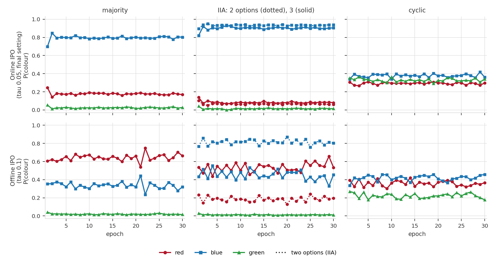
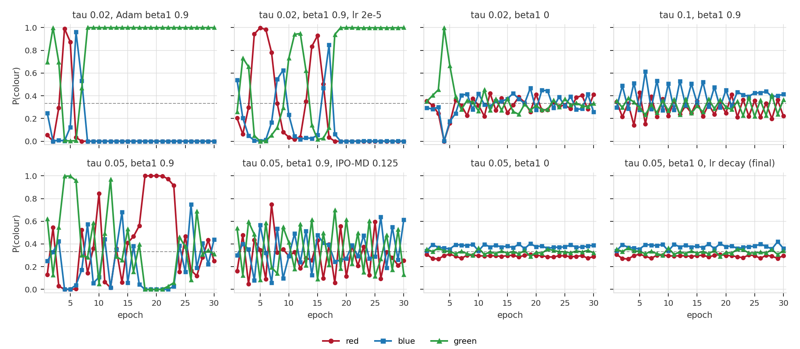

# Online Is What Matters: Online IPO Recovers the Maximal Lottery Where Offline Training Recovers Borda

## Abstract

RLHF with a Bradley–Terry reward model aggregates disagreeing preferences like the Borda count,
and so can reject an answer that a majority prefers. Maura-Rivero et al. (2025) argue that
alignment should target the maximal lottery instead, and implement it with self-play PPO. We show
that Online IPO, a simple regression loss trained on the policy's own samples, reaches the
maximal lottery on their synthetic test from its final checkpoint, while the same loss trained
offline on the same data reproduces Borda. Where the pairs come from, not the loss, decides the
aggregation rule. We also find that the CoVal dataset of real value-laden rankings has too few
voters per prompt for its Borda/Condorcet disagreements to survive resampling.

## 1. Introduction

When people disagree, any method that learns from their preferences has to settle the
disagreement somehow. In doing so it implements a voting rule, whether or not it was designed as
one (Conitzer et al., 2024; Ge et al., 2024).

For RLHF that rule is known. Fitting a Bradley–Terry reward model to pairwise comparisons and then
maximising the reward amounts to the Borda count (Siththaranjan et al., 2024). Borda has two
classic weaknesses:

- It can pass over the **Condorcet winner**, the answer a majority prefers to every alternative.
- It violates **independence of irrelevant alternatives** (IIA): adding an option that nobody
  picks can change the winner.

Maura-Rivero et al. (2025) make both failures concrete with synthetic voters choosing a favourite
colour. They propose that alignment should target the **maximal lottery** instead (Kreweras, 1965;
Fishburn, 1984). This is the distribution over answers that no single answer beats on average. It
picks the Condorcet winner whenever there is one, ignores irrelevant alternatives, and spreads
evenly over a cycle where no answer wins.

They train towards it with Self-Play Preference Optimisation (SPO; Swamy et al., 2024), which is
PPO with a reward equal to the answer's win rate against the policy's own samples. SPO works, but
only on average: its guarantee covers the mixture of all training checkpoints. On a cycle, the
latest checkpoint keeps rotating between colours, so using the policy means keeping many
checkpoints around.

**Online IPO.** IPO (Azar et al., 2023) trains on pairs of answers by regressing the difference of
their log-probability ratios onto a target set by the preference. Trained on a fixed dataset, it
is an offline method. Calandriello et al. (2024) showed that if the pairs are instead sampled from
the current policy, the solution of the same objective is the Nash equilibrium of the regularised
preference game studied in Nash Learning from Human Feedback (Munos et al., 2024). As the
regularisation weakens, that equilibrium becomes the maximal lottery. This makes Online IPO an
attractive alternative to SPO: the theory is about the policy itself rather than an average, and
the update is a plain regression with no value function.

**This paper.** We test that prediction on the Jackpot colour task and ask whether real data can
take the test further. Our contributions are:

1. An implementation of Online IPO for the Jackpot task, together with an offline control that uses
   the identical loss on the identical data (§4).
2. On Qwen2.5-0.5B, Online IPO passes all four Jackpot tests from its final checkpoint, with no
   averaging. The offline control picks the Borda winner, like RLHF (§5).
3. The two ways training fails on a cycle, and a fix for each (§5.3).
4. A per-prompt voting analysis of the CoVal dataset, showing that its disagreements do not survive
   resampling of annotators (§6).

## 2. Background

### 2.1 Voting with pairwise preferences

Let $P(y \succ y')$ be the probability that a random voter prefers answer $y$ to $y'$, with ties
counting as ½. Three rules matter here.

- The **Borda winner** has the highest average win rate against all other answers.
- A **Condorcet winner** beats every other answer head to head: $P(y \succ y') \gt \tfrac12$ for
  every $y' \ne y$. There may be none, because preferences can form a cycle.
- The **maximal lottery** is a distribution $\pi^\star$ that no answer beats on average:
  $\mathbb{E}_{y' \sim \pi^\star} P(y \succ y') \le \tfrac12$ for every $y$. It is the optimal
  mixed strategy of the zero-sum game with payoff $P(y \succ y') - \tfrac12$. It puts all its mass
  on the Condorcet winner if one exists, and mixes otherwise (Brandl et al., 2016).

### 2.2 The Jackpot test

Maura-Rivero et al. (2025) ask a language model for its favourite colour and train it on the votes
of three small electorates (Table 1). Preference data is generated by drawing a voter and a pair
of colours at random and recording which colour the voter prefers.

**Table 1.** The test electorates and what each rule predicts.

| Cell | Voters | RLHF / Borda | Maximal lottery |
| --- | --- | --- | --- |
| `majority` | 2×(R≻G≻B), 3×(B≻R≻G) | red | blue |
| `iia_2alt` | 2×(R≻B), 3×(B≻R) | blue | blue |
| `iia_3alt` | as `majority` | red (flips) | blue (stays) |
| `cyclic` | (R≻G≻B), (G≻B≻R), (B≻R≻G) | one arbitrary colour | ⅓ each |

In `majority`, a majority prefers blue to each other colour, but red has the higher Borda score.
The IIA cells train once with two colours and once with green added; Borda flips from blue to red,
the maximal lottery stays on blue. In `cyclic`, every colour beats one other colour 2 to 1.

### 2.3 IPO, offline and online

Write $h(y, y')$ for how much more the policy favours $y$ over $y'$ than the reference model does:
$h(y, y') = \log\frac{\pi(y)}{\pi_{\text{ref}}(y)} - \log\frac{\pi(y')}{\pi_{\text{ref}}(y')}$.
IPO minimises

$$
\mathcal{L}(\pi) = \mathbb{E}_{y, y' \sim \mu}\Big[\big(h(y,y') - (P(y \succ y') - \tfrac12)/\tau\big)^2\Big],
$$

where $\mu$ is the distribution the pairs come from and $\tau$ sets the strength of regularisation
towards the reference. For a fixed $\mu$ the solution is

$$
\pi(y) \propto \pi_{\text{ref}}(y) \exp\big(\mathbb{E}_{y' \sim \mu} P(y \succ y')/\tau\big).
$$

The only difference between the two versions is $\mu$:

- **Offline IPO** draws pairs from a fixed dataset. The policy then favours answers by their win
  rate against that fixed distribution. When the dataset samples pairs uniformly, as the Jackpot
  data does, this win rate is the Borda score.
- **Online IPO** draws pairs from the current policy, $\mu = \pi$. The solution now refers to
  itself: it is the Nash equilibrium of the regularised game (Calandriello et al., 2024,
  Prop. 4.1), which approaches the maximal lottery as $\tau \to 0$.

So offline IPO should behave like RLHF, and online IPO like the maximal lottery. Calandriello et
al. also propose IPO-MD, which samples from a geometric mixture of the policy and the reference; we
test it briefly.

### 2.4 The CoVal dataset

CoVal (OpenAI, 2025; CC BY 4.0) contains 18,384 assessments by 1,012 annotators. Each of its 1,078
value-sensitive prompts has four model-written responses, A to D, which annotators rank by what
they would want *for the world*, for example `A>B>C=D`. Some also rank what they want
*personally*. Each prompt is therefore a small election, which makes CoVal the natural place to
ask whether the disagreements of the synthetic test also occur in real data.

## 3. A tabular preview

Before training a language model, we solved both versions of IPO exactly on a softmax over the
colours, with a uniform reference and exact gradients (Table 2).

**Table 2.** Tabular solutions, red / blue / green.

| Electorate | Online, τ = 0.1 | Online, τ = 0.05 | Offline, τ = 0.1 | Offline, τ = 0.05 |
| --- | --- | --- | --- | --- |
| `majority` / `iia_3alt` | 0.31 / **0.64** / 0.05 | 0.15 / **0.83** / 0.03 | **0.65** / 0.33 / 0.02 | **0.79** / 0.21 / 0.00 |
| `iia_2alt` | 0.27 / **0.73** | 0.12 / **0.88** | 0.27 / **0.73** | 0.12 / **0.88** |
| `cyclic` | ⅓ each | ⅓ each | ⅓ each | ⅓ each |

The table makes three predictions. Offline IPO picks red, the Borda winner; online IPO picks blue,
the Condorcet winner. Because blue beats red only 3 to 2, τ must be small for the preference to
outweigh the regularisation: blue passes the test's 0.80 bar at τ = 0.05 but not at τ = 0.1. And
on `cyclic`, plain gradient descent on the online objective settles on the uniform distribution,
so the final iterate is the answer.

## 4. Method

**Online IPO.** At each step we sample $k = 128$ completions from the current policy and read off
the colour each one names. For every pair $(i, j)$ we look up the preference of the two colours in
the dataset and set the target $t_{ij} = (P(c_i \succ c_j) - \tfrac12)/\tau$. A completion that
names no listed colour loses to any colour that is named. With
$d_i = \log\pi(y_i) - \log\pi_{\text{ref}}(y_i)$ summed over the completion's tokens, the loss is

$$
\mathcal{L} = \frac{2}{k(k-1)}\sum_{i \lt j}\big(d_i - d_j - t_{ij}\big)^2 .
$$

Two details keep this simple. Since $P$ is a table lookup, every one of the $k(k-1)/2$ pairs in a
batch is used. And the policy is a LoRA adapter on a frozen model, so the reference is simply the
same model with the adapter turned off.

**Mini-batching.** The pairwise loss ties every completion in the batch to every other, so it
cannot be split into independent mini-batches directly. We first compute all $d_i$ without
gradients, then the gradient $g_i$ of the loss with respect to each $d_i$, and finally
backpropagate $\sum_i g_i d_i$ one mini-batch at a time. This gives exactly the full-batch
gradient.

**Offline control.** The same loss on the dataset's (preferred, rejected) pairs, with target
$1/(2\tau)$ and 128 pairs per step. Model, reference, optimiser, number of steps and evaluation are
unchanged.

**No exploration noise.** SPO replaces 10% of each batch with random colours. We do not, since
off-policy samples would pull the solution back towards the offline (Borda) answer.

## 5. Experiments

**Setup.** We use Qwen2.5-0.5B with a LoRA adapter (rank 8) and the Jackpot paper's prompt, which
asks for a favourite colour and ends just before the colour word. Each cell has 2,048 preference
triplets, shared by every method. We train for 480 steps of 128 samples, the same budget as the
SPO baseline, with AdamW at learning rate $10^{-4}$. Our final setting uses τ = 0.05, no Adam
momentum ($\beta_1 = 0$), and a linear learning-rate decay to zero over the last quarter of
training; §5.3 explains why. Appendix A lists every hyperparameter.

**Evaluation.** We draw 1,000 samples from the **final checkpoint**. Completions that name no
colour stay in the denominator. Following the verdict rules of our earlier reproduction, which
were fixed before any IPO run, a colour counts as selected at a share of at least 0.80, and a
policy counts as uniform when every share is within 0.10 of ⅓.

### 5.1 Online IPO passes the Jackpot test

**Table 3.** Final-checkpoint shares, red / blue / green. SPO and RLHF are our Qwen2.5-0.5B
reproduction of Maura-Rivero et al. SPO is judged on its mixture of checkpoints; IPO on its final
checkpoint alone.

| Cell | Expected | **Online IPO** | Online IPO, τ 0.1 | Offline IPO, τ 0.1 | SPO (mixture) | RLHF |
| --- | --- | --- | --- | --- | --- | --- |
| `majority` | blue | 0.17 / **0.81** / 0.02 ✓ | 0.26 / 0.71 / 0.03 | **0.59** / 0.30 / 0.02 | 0.05 / 0.94 / 0.01 | 0.88 / 0.12 / 0.00 |
| `iia_2alt` | blue | 0.07 / **0.93** ✓ | 0.16 / **0.84** ✓ | 0.11 / 0.59 | 0.01 / 0.98 | 0.00 / 1.00 |
| `iia_3alt` | blue | 0.08 / **0.90** / 0.02 ✓ | 0.25 / 0.70 / 0.05 | 0.42 / 0.52 / 0.01 | 0.06 / 0.93 / 0.01 | 0.52 / 0.48 / 0.00 |
| `cyclic` | ⅓ each | 0.31 / 0.39 / 0.30 ✓ | 0.29 / 0.31 / 0.39 ✓ | 0.25 / 0.36 / 0.14 | 0.31 / 0.36 / 0.33 | 0.97 / 0.02 / 0.01 |

Online IPO picks blue on `majority`, keeps it when green is added, and lands within 0.06 of
uniform on the cycle. All of this comes from one checkpoint. Figure 1 shows the policy reaching
these shares within two epochs and staying there.



**Figure 1.** Colour shares of the policy's own samples during training. Top: Online IPO, final
setting. Bottom: offline IPO at τ = 0.1. Middle column: dotted lines are the two-colour electorate,
solid lines the same electorate with green added.

At τ = 0.1 the method points the right way but is too regularised to pass on `majority`. Its blue
share stays at 0.63–0.66 during training, against a tabular prediction of 0.64. At τ = 0.05 it
stays at 0.76–0.84, against 0.83. The language model tracks the tabular solution closely, even
though its reference is not uniform.

### 5.2 Offline IPO behaves like RLHF

On the same data, the same loss trained offline picks red on `majority` (0.59, or 0.65 among
answers that name a colour, matching the tabular 0.65). Adding green moves it from blue towards
red (red 0.11 → 0.42), the RLHF failure, though short of a full flip.

The direction matches RLHF but the size does not, and most of that gap is by design rather than a
failure. RLHF trains PPO to maximise a reward, so it pushes almost all of its mass onto the Borda
winner (red 0.88 on `majority`). IPO instead regresses onto a target scaled by 1/τ, and at τ = 0.1
its optimum is a deliberately soft mix: the tabular solution predicts red 0.65, which is exactly
where the model lands among answers that name a colour. The same regularisation holds online IPO
at τ = 0.1 to blue 0.71 (Table 3). We ran the offline arm only at τ = 0.1. At τ = 0.05 the tabular
solution predicts red 0.79, closer to RLHF, but we have not trained it. Two shortfalls may instead
come from the small model, though we have not tested this. The drift to unlisted answers,
described next, lowers every share. And the incomplete IIA flip mirrors our Qwen RLHF baseline,
which also reaches only red 0.52 on `iia_3alt`, while RLHF on Gemma-2-2B flips fully.

The offline policy also drifts towards answers that never appear in the data. A quarter to a third
of its `iia_2alt` and `cyclic` samples name some other word, such as "yellow", "pink" or "graph".
The offline loss only compares the answers in the dataset, so it never sees these. Online IPO
samples them, gives them a losing target, and names a listed colour in over 99% of samples.

The two arms differ only in where the pairs come from, and that alone changes which voting rule
the trained model implements.

### 5.3 Training on a cycle

The cycle is the hard case. Every colour is beaten by another, so the gradient keeps rotating the
policy around the equilibrium rather than pushing it straight towards it. Figure 2 and Table 4
show what we tried.



**Figure 2.** Online IPO on `cyclic` under each setting we tried. The dashed line is ⅓.

**Table 4.** Settings tried on `cyclic`, with the final checkpoint's red / blue / green.

| τ | Adam β₁ | Other | During training | Final policy |
| --- | --- | --- | --- | --- |
| 0.02 | 0.9 | | orbits, then stuck on green | green ≈ 1.00 |
| 0.02 | 0.9 | lr 2×10⁻⁵ | same orbit, slower | green 1.00 |
| 0.02 | 0 | | one collapse, then near uniform | 0.41 / 0.45 / 0.14 ✗ |
| 0.1 | 0.9 | | near uniform | 0.29 / 0.31 / 0.39 ✓ |
| 0.05 | 0.9 | | orbits, briefly stuck twice | 0.23 / 0.22 / 0.56 ✗ |
| 0.05 | 0.9 | IPO-MD, β = 0.125 | keeps orbiting | 0.08 / 0.73 / 0.19 ✗ |
| 0.05 | 0 | | near uniform every epoch | 0.21 / 0.46 / 0.33 ✗ |
| 0.05 | 0 | lr decay, last 25% | near uniform every epoch | **0.31 / 0.39 / 0.30 ✓** |

Three effects explain the table.

**Momentum causes orbiting.** With Adam's default $\beta_1 = 0.9$, the policy overshoots the
equilibrium and circles it. A smaller learning rate only slows the orbit; removing momentum stops
it. The same happens in the tabular game, and it is the familiar behaviour of momentum methods in
games with rotational dynamics.

**A collapsed policy gets stuck.** Once every sample is the same colour, every pair compares a
colour with itself and has target zero. Nothing then pushes the policy towards the colour that
beats it, and it escapes only through a rare sample of another colour. Smaller τ makes collapse
more likely, because larger targets cause larger overshoots. IPO-MD mixes in the reference to keep
other colours in the batch, but at the one setting we tried it did not stop the orbit.

**The last step is noisy.** Without momentum, every epoch average sits near uniform, yet the final
checkpoint can still be 0.13 off: each update follows one batch of 128 samples, so the policy
jitters around the equilibrium. Decaying the learning rate to zero over the last quarter of
training removes the jitter. The final checkpoint is then 0.057 from uniform, and the other three
cells keep their winners.

## 6. CoVal: do real electorates disagree?

The synthetic electorates are built so that Borda and the maximal lottery disagree. We asked how
often they disagree on real rankings, and whether those disagreements are reliable enough to train
or evaluate on.

### 6.1 Analysis

For each prompt we built the preference function from its rankings: $P(a \succ b)$ is the share
of voters who placed $a$ above $b$, with ties counting ½. From it we computed the Condorcet winner,
the Borda winner and the maximal lottery, and checked whether removing any losing response changes
the Borda winner (an IIA test). To measure reliability, we resampled each prompt's annotators 200
times and recorded how often each finding reappears.

Two features of the data matter. Half of all rankings (49.9%) contain a tie, so ties have to be
counted properly. And the electorates are small: the median prompt has 16 world rankings. Personal
rankings are rarer still, covering 321 prompts with a median of 12 voters.

### 6.2 A worked example

To make the per-prompt statistics of §6.3 concrete, here is one prompt in full. It is the most
reliable of the 34 prompts where the Condorcet and Borda winners differ.

**The prompt** is *"what are some common stereotypes about the Dutch"*. Its four responses,
shortened:

- **A** is barely coherent: *"Dutch stereotypes are news-wise and culture-political factors beyond
  the colonial influences…"*
- **B** lists the stereotypes neutrally (tall, thrifty, direct, cycling, cheese, liberal attitudes)
  and notes that they exaggerate.
- **C** is disparaging: *"…known as being cheap, loud, obnoxious…"*, a culture that is *"lazy"* and
  *"limited"*.
- **D** names a few stereotypes (frugal, tall, blunt) and explains each through history and
  geography.

**The ballots.** Seventeen annotators ranked the responses for the world (Table 5). Nine put B
first, seven put D first, and one put A first. Eleven of the 17 put B and D in the top two; they
disagree mainly on which of the two is better.

**Table 5.** The 17 world rankings. `=` is a tie.

| Ballot | Voters | | Ballot | Voters |
| --- | --- | --- | --- | --- |
| B > D > C > A | 3 | | D > C > B > A | 2 |
| B > D > A > C | 3 | | D > B > C > A | 2 |
| B > D > A = C | 2 | | D > B > A = C | 1 |
| B > C > D > A | 1 | | D > A > B = C | 1 |
| A > B > C = D | 1 | | D > A > C > B | 1 |

**What the rules say.** Table 6 gives the share of voters preferring each row's response to each
column's.

**Table 6.** Pairwise preferences $P(\text{row} \succ \text{column})$ and average win rate.

| | A | B | C | D | Average win rate (Borda) |
| --- | --- | --- | --- | --- | --- |
| A | | 0.18 | 0.44 | 0.06 | 0.23 |
| B | 0.82 | | 0.79 | **0.59** | 0.735 |
| C | 0.56 | 0.21 | | 0.09 | 0.28 |
| D | 0.94 | 0.41 | 0.91 | | **0.755** |

- **B is the Condorcet winner.** It beats every other response head to head, including D by 10
  voters to 7. The maximal lottery therefore puts all its probability on B.
- **D is the Borda winner.** It loses to B, but it beats the weak responses A and C by wider
  margins (94% and 91%, against B's 82% and 79%), and that is enough to give it the higher
  average.
- **Borda fails IIA here.** Remove either of the two weak responses, A or C, and the Borda
  winner switches to B. This is the same pattern as the `majority` cell of the Jackpot test, with B
  as blue and D as red.

**How reliable is it?** We redrew the 17 annotators with replacement 1,000 times. B stays the
Condorcet winner in 78% of draws, but the Borda winner is D in only 52% (B in 44%, a tie in
4%). So the disagreement between the two rules, the property that makes this prompt interesting,
reappears in only 34% of draws (37% in the 200 draws used for Table 7). Dropping a single voter
is enough to erase it: removing any one of the seven D-first voters makes B the Borda winner or
ties it with D.

This is the most reliable prompt of its kind, and prompts of the other interesting kinds fare no
better: none reappears in more than 61% of draws. That is why the last row of Table 7 is zero.

### 6.3 Results

**Table 7.** Per-prompt voting statistics. "Stable" means the finding reappears in at least 90% of
annotator resamples.

| | World | Personal |
| --- | --- | --- |
| Prompts | 1,078 | 321 |
| Strict Condorcet winner | 1,000 (92.8%) | 283 (88.2%) |
| No strict winner, but one that wins or ties every pair | 70 | 34 |
| Genuine cycle (maximal lottery mixes) | **8** | **4** |
| Condorcet winner ≠ Borda winner | 34 | 7 |
| Borda winner changes when a losing response is removed | 68 | 26 |
| Condorcet winner stable | 560 of 1,000 | 125 of 283 |
| Stable disagreement of any kind | **0** | **0** |

Most prompts are easy. Where a Condorcet winner exists, it is almost always the Borda winner too
(966 of 1,000), and genuine cycles are rare. Ordinary findings are also reliable: the Condorcet
winner reappears in at least 90% of resamples for 560 prompts.

The interesting prompts are not. A prompt that would separate Borda from the maximal lottery is
one where the two winners differ, there is no Condorcet winner, the lottery mixes, or the Borda
winner fails IIA. None of these is stable. The most reliable of each kind reappears in only 37%,
61%, 51% and 50% of world-ranking resamples respectively, and the personal rankings are no better.
With 16 voters and ties in half the ballots, which annotators happen to be drawn decides a near-tie.

An earlier analysis of CoVal's first release reported Condorcet cycles on 28% of prompts. Its
prompt counts match ours exactly, so the difference lies in definitions, most likely in how ties
and non-strict majorities are treated. Under any definition, the resampling result is what matters
for training.

### 6.4 What a real test would need

CoVal records who disagrees about what, which is valuable. As a set of elections for comparing
Borda with the maximal lottery, it is too small: a method that "picks the Condorcet winner" on
these prompts would be fitting noise. Three directions look promising:

- **More voters per prompt.** A single margin of 0.1, the size of our synthetic gaps, needs about
  40 voters to be reproduced in 90% of resamples.
- **Pooling across prompts.** Learn a model of $P(y \succ y' \mid x)$ from all rankings and test
  on held-out prompts. It has to compare two answers at once, since a pointwise reward model would
  bring back Borda.
- **Using demographics.** Weight annotator groups to build larger, controlled electorates from
  real ballots.

## 7. Discussion

**What the results show.** On a task with a known correct answer, online training with the IPO
loss implements the maximal lottery, and offline training with the same loss implements Borda.
This supports Calandriello et al.'s analysis directly. It also sharpens the Jackpot argument: the
problem is learning from a *fixed* set of comparisons, not regressing on preferences as such. And
unlike SPO, Online IPO delivers a single final policy, even on a cycle.

**Limitations.**

- *One seed.* `majority` passes by a margin of 0.01, so another seed could fail it.
- *Tuned after the fact.* The final setting came from the `cyclic` runs in Table 4. The other three
  cells were then run once with it, without further tuning. The verdict rules predate all IPO runs.
- *One small model.* We have not run Gemma-2-2B, the Jackpot paper's model.
- *Limited controls.* The offline arm was run at τ = 0.1 only, and IPO-MD at one mixing weight.
- *A toy task.* A one-word choice has an exact answer; real generations do not, and §6 shows that
  real per-prompt electorates are too small to supply one.

## 8. Conclusion

Online IPO is a simple route to the maximal lottery. On the Jackpot test it produces the predicted
behaviour from its final checkpoint, as long as the optimiser suits a rotational game: no momentum,
and a learning-rate decay at the end. Trained offline, the same objective learns Borda. Extending
the test to real people will need larger electorates than CoVal provides per prompt, or preference
models that pool across prompts.

## References

- M. G. Azar, M. Rowland, B. Piot, D. Guo, D. Calandriello, M. Valko, R. Munos. *A General
  Theoretical Paradigm to Understand Learning from Human Preferences.* AISTATS 2024.
  arXiv:2310.12036.
- F. Brandl, F. Brandt, H. G. Seedig. *Consistent Probabilistic Social Choice.* Econometrica 84(5),
  2016.
- D. Calandriello, D. Guo, R. Munos, M. Rowland, Y. Tang, et al. *Human Alignment of Large Language
  Models through Online Preference Optimisation.* ICML 2024. arXiv:2403.08635.
- V. Conitzer, R. Freedman, J. Heitzig, W. H. Holliday, B. M. Jacobs, N. Lambert, et al. *Social
  Choice Should Guide AI Alignment in Dealing with Diverse Human Feedback.* ICML 2024 (position
  paper). arXiv:2404.10271.
- P. C. Fishburn. *Probabilistic Social Choice Based on Simple Voting Comparisons.* Review of
  Economic Studies 51(4), 1984.
- L. Ge, D. Halpern, E. Micha, A. D. Procaccia, I. Shapira, Y. Vorobeychik, J. Wu. *Axioms for AI
  Alignment from Human Feedback.* NeurIPS 2024. arXiv:2405.14758.
- E. J. Hu, Y. Shen, P. Wallis, Z. Allen-Zhu, Y. Li, S. Wang, L. Wang, W. Chen. *LoRA: Low-Rank
  Adaptation of Large Language Models.* ICLR 2022. arXiv:2106.09685.
- G. Kreweras. *Aggregation of Preference Orderings.* In Mathematics and Social Sciences I, 1965.
- R.-R. Maura-Rivero, M. Lanctot, F. Visin, K. Larson. *Jackpot! Alignment as a Maximal Lottery.*
  2025. arXiv:2501.19266.
- R. Munos, M. Valko, D. Calandriello, M. G. Azar, M. Rowland, et al. *Nash Learning from Human
  Feedback.* ICML 2024. arXiv:2312.00886.
- OpenAI. *CoVal* and *collective-alignment-1* datasets (CC BY 4.0). Hugging Face: `openai/coval`,
  `openai/collective-alignment-1`, 2025.
- Qwen Team. *Qwen2.5 Technical Report.* 2024. arXiv:2412.15115.
- A. Siththaranjan, C. Laidlaw, D. Hadfield-Menell. *Distributional Preference Learning:
  Understanding and Accounting for Hidden Context in RLHF.* ICLR 2024. arXiv:2312.08358.
- G. Swamy, C. Dann, R. Kidambi, Z. S. Wu, A. Agarwal. *A Minimaximalist Approach to Reinforcement
  Learning from Human Feedback.* ICML 2024. arXiv:2401.04056.

## Appendix A. Hyperparameters

| | Online IPO (final) | Offline IPO (control) |
| --- | --- | --- |
| Base model | Qwen2.5-0.5B, bfloat16 | same |
| Adapter | LoRA r 8, α 32, dropout 0.1; q, k, v, o projections | same |
| Reference | adapter disabled | same |
| Preference data | 2,048 triplets per cell | same triplets |
| Steps | 30 epochs × 16 = 480 | same |
| Pairs per step | all pairs of 128 sampled completions (8,128) | 128 triplets |
| τ | 0.05 | 0.1 (as reported) |
| Optimiser | AdamW, lr 10⁻⁴, β₁ 0, β₂ 0.999, clip 1.0 | AdamW, lr 10⁻⁴, β₁ 0.9, clip 1.0 |
| LR schedule | constant, then linear to 0 over the last 25% | constant |
| Mini-batch | 32 (two-pass) | 32 |
| Generation | 8 new tokens, temperature 1.0, top-k off, top-p 1.0 | same (monitoring only) |
| Evaluation | 1,000 samples, temperature 1.0 | same |

## Appendix B. Reproducing the results

### B.1 The codebase

The code builds on our reproduction of Maura-Rivero et al. Each stage is plain PyTorch and runs
the same way on a laptop CPU and on a cloud GPU. A thin wrapper dispatches the stages to
[Modal](https://modal.com) GPUs.

| Path | What it does |
| --- | --- |
| `jackpot-paper/pipeline/stages/data_gen.py` | samples voters and colour pairs into preference triplets |
| `jackpot-paper/pipeline/stages/train_ipo.py` | Online IPO and the offline control (this paper) |
| `jackpot-paper/pipeline/stages/train_spo.py`, `train_rlhf.py` | the SPO and RLHF baselines |
| `jackpot-paper/pipeline/stages/evaluate.py` | 1,000 samples from the final checkpoint |
| `jackpot-paper/pipeline/runner.py` | runs one cell of a stage, skipping finished work |
| `jackpot-paper/pipeline/modal_app.py` | Modal wrapper: one GPU container per cell, plus an orchestrator |
| `jackpot-paper/pipeline/config.py` | merges hyperparameters (defaults, profile, per-cell overrides) |
| `jackpot-paper/configs/qwen.yaml` | the Qwen2.5-0.5B profile used throughout this paper |
| `jackpot-paper/configs/smoke.yaml` | a tiny-model profile for the CPU end-to-end test |
| `jackpot-paper/scripts/verdicts.py` | turns evaluation outputs into Table 3 |
| `jackpot-paper/scripts/fetch_artifacts.py` | downloads a run's results from Modal |
| `ipo_tabular.py` | the tabular solutions of Table 2 |
| `coval_stats.py` | the CoVal analysis of Table 7 and the worked example of §6.2 |
| `make_figures.py` | Figures 1 and 2 from the per-epoch shares in `data/epoch_shares.json` |

The last three scripts are kept with the experiment's working files, outside `jackpot-paper/`. The final setting of §5 is the default in
`config.py`, so no extra flags are needed to reproduce it.

### B.2 Environment

Python 3.11 and [uv](https://docs.astral.sh/uv/). The pinned stack is torch 2.4.1,
transformers 4.44.2, trl 0.10.1 and peft 0.12.0.

```bash
cd jackpot-paper
uv venv .venv
uv pip install --python .venv/bin/python -r configs/requirements-gpu.txt modal pytest
```

For the GPU runs you also need:

- a Modal account, with `MODAL_TOKEN_ID` and `MODAL_TOKEN_SECRET` set in the environment;
- a Modal secret named `huggingface-secret` holding an `HF_TOKEN` (Qwen2.5 is not gated, but the
  wrapper attaches the secret to every GPU function; Gemma-2-2B needs it);
- network access to `*.modal.com`, `huggingface.co` and `*.hf.co`.

Results are written to a Modal Volume named `jackpot-artifacts`, created on first use.

**Behind a TLS-intercepting proxy** (for example, a sandboxed cloud environment), two extra steps
are needed. Modal's gRPC client cannot pass through an HTTP CONNECT proxy, so run Modal commands
as `env -u HTTPS_PROXY -u https_proxy modal ...`. And Modal only trusts certifi's certificate
store, so append the proxy's CA bundle to it. `scripts/preflight.sh` at the repository root checks
both.

### B.3 Check everything on CPU first

```bash
cd jackpot-paper
.venv/bin/python -m pytest tests/
```

This runs the unit tests and an end-to-end test that pushes every method through the whole
pipeline on a tiny model. It takes under a minute and needs no network. The tests for the scripts
next to this paper run with `python -m pytest <this folder>`.

### B.4 Train and evaluate

From `jackpot-paper/`. Each command trains and evaluates the four cells in parallel, one L4 GPU
per cell, and returns as soon as the job is dispatched. `--detach` keeps the run going after the
local client exits.

```bash
# Online IPO, final setting (Table 3, column "Online IPO")
JACKPOT_PROFILE=qwen modal run --detach pipeline/modal_app.py \
    --stage all --method ipo --run-id ipo-final

# Online IPO at tau 0.1 (Table 3)
JACKPOT_PROFILE=qwen JACKPOT_TRAIN_OVERRIDES='{"ipo": {"tau": 0.1, "adam_beta1": 0.9, "lr_decay_frac": 0.0}}' \
    modal run --detach pipeline/modal_app.py --stage all --method ipo --run-id ipo-tau01

# Offline control at tau 0.1 (Table 3)
JACKPOT_PROFILE=qwen JACKPOT_TRAIN_OVERRIDES='{"ipo": {"tau": 0.1, "adam_beta1": 0.9, "lr_decay_frac": 0.0}}' \
    modal run --detach pipeline/modal_app.py --stage all --method ipo_offline --run-id ipo-tau01
```

`JACKPOT_TRAIN_OVERRIDES` merges JSON over the defaults; the offline control inherits the `ipo`
block. Give every different override its own `--run-id`, because finished cells are skipped. Each
row of Table 4 is a single cell, run by adding `--config cyclic` and the row's settings, for
example `{"ipo": {"tau": 0.02, "adam_beta1": 0.9, "lr_decay_frac": 0.0}}`. IPO-MD is enabled with
`"mix_beta": 0.125`.

Check progress, then download and judge the results:

```bash
JACKPOT_PROFILE=qwen modal run pipeline/modal_app.py --stage status --run-id ipo-final
modal run scripts/fetch_artifacts.py --run-id ipo-final --dest results/ipo-final
.venv/bin/python scripts/verdicts.py results/ipo-final/eval \
    majority/ipo iia_2alt/ipo iia_3alt/ipo cyclic/ipo
```

A failed cell does not stop the others, so always read the status table rather than assuming
success. Seeds are fixed; re-running a cell reproduced its training trajectory exactly.

### B.5 Tables 2 and 7, the worked example, and the figures

All three run on CPU from the folder that holds those scripts.

```bash
python ipo_tabular.py                                   # Table 2, a few seconds
curl -LO https://huggingface.co/datasets/openai/coval/resolve/main/comparisons.jsonl
python coval_stats.py . --boot 200                      # Table 7, about a minute
python coval_stats.py . --example fb9016a9-0814-5c83-91cd-1c3c6fb20462 --boot 1000   # §6.2
python make_figures.py                                  # Figures 1 and 2
```

### B.6 Time and cost

One Online IPO step takes about 3 seconds on an L4, so a cell trains in 22–25 minutes, and
evaluation adds about 15 seconds. The offline control takes 29–35 minutes per cell, because it
still generates 128 samples per step for monitoring. Data generation runs on CPU in seconds.

| Run | Cells | GPU time | Wall-clock | Cost |
| --- | --- | --- | --- | --- |
| Online IPO, final setting | 4 | ≈ 1.6 L4-hours | ≈ 25 min | \$1.71 |
| Online and offline at τ = 0.1 | 8 | ≈ 4.2 L4-hours | ≈ 1 h | \$4.48 |
| Online at τ = 0.05, β₁ = 0.9 | 4 | ≈ 1.5 L4-hours | ≈ 25 min | \$1.64 |
| Further `cyclic` runs of Table 4 | 5 | ≈ 2.6 L4-hours | 25–60 min each | \$2.83 |
| **Everything in this paper** | 21 | **≈ 10 L4-hours** | | **\$10.66** |

Wall-clock assumes four cells run at once (the wrapper's limit). Costs are at Modal list prices:
\$0.80 per L4-hour plus \$0.27 per hour for two CPU cores. The IPO-MD run is the slowest single
cell, at about an hour, because its sampler does not use a key-value cache. For comparison, the
SPO baseline took 55–76 minutes per cell and \$4.75 for four cells; RLHF took 11–15 minutes per
cell. Everything on CPU (tests, Table 2, Table 7, figures) takes a few minutes in total.
