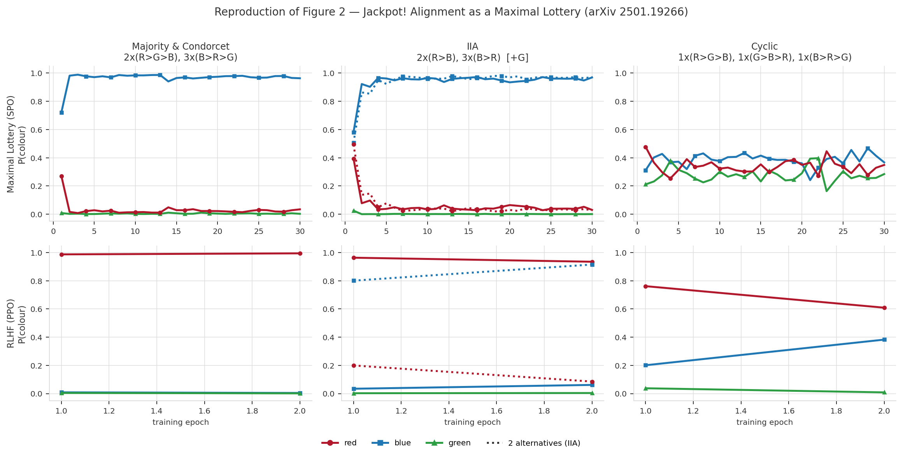
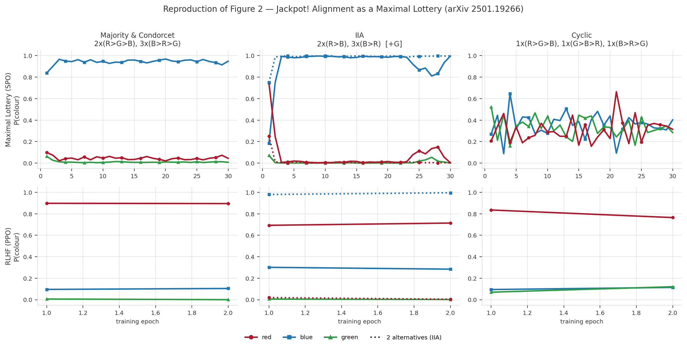

# Reproduction report: Jackpot! Alignment as a Maximal Lottery

| | |
| --- | --- |
| Paper | Maura-Rivero et al., *Jackpot! Alignment as a Maximal Lottery*, [arXiv:2501.19266](https://arxiv.org/abs/2501.19266), Section 6.3 / Figure 2 |
| Model | Gemma-2-2B, the paper's model; Qwen2.5-0.5B as a cheaper screening model |
| Cost of a full run | about \$11 on Gemma-2-2B, about \$6 on Qwen2.5-0.5B |
| Date | 2026-09-18 |

## Summary

- **The paper's Figure 2 reproduces on Gemma-2-2B: 8 of 8 cells** match its predictions.
  RLHF picks the Borda winner and flips when an irrelevant option is added; the Maximal
  Lottery picks the Condorcet winner, ignores the irrelevant option, and splits a cycle
  evenly. Qwen2.5-0.5B gives 7 of 8; its one miss points the right way but falls short of
  the bar (Appendix D).
- **The mechanisms are visible directly.** The reward model ranks colours like a Borda
  count, and the Maximal Lottery's mixture of iterates converges on the cycle while its
  last iterate orbits (section 3).
- **Three caveats.** Every cell is a single seed. Five per-cell KL anchors were chosen
  after seeing results, where the paper uses one setting per arm (Appendix A). And we
  generate 8 tokens where the paper may have generated one, which may explain several of
  our deviations from its hyperparameters (section 4).
- **Next:** a run of the paper's hyperparameters verbatim with one-token generation, then a
  frozen confirmation run on fresh data. Both need a budget decision (section 5).

## 1. Setup

The paper trains a language model to answer one fixed question ("What is your favorite
color from the options red, blue and green?") under two objectives:

- **RLHF**: a Bradley-Terry reward model fine-tuned on 2048 preference triplets, then PPO
  against it.
- **Maximal Lottery** (SPO, the paper's Algorithm 1): PPO with a preference reward. Each
  sampled answer is scored by its win rate against the other answers in the batch, 10% of
  the batch is replaced by random colours, and the returned policy is the uniform mixture
  of the training iterates.

It compares them on three synthetic voter populations:

| Population | Voters | RLHF should give | Maximal Lottery should give |
| --- | --- | --- | --- |
| majority | 2×(R>G>B), 3×(B>R>G) | red, the Borda winner | blue, the Condorcet winner |
| IIA | 2×(R>B), 3×(B>R), then the same with an irrelevant green added | blue, then flips to red | blue in both |
| cyclic | 1×(R>G>B), 1×(G>B>R), 1×(B>R>G) | one arbitrary colour | about 1/3 each |

**How results are judged.** 1000 samples per trained policy at temperature 1.0. The first
colour word in an answer is its vote; answers naming no colour count against every colour.
A colour "wins" at a share of at least 0.80; "uniform" means every share is within 0.10 of
1/3. Maximal Lottery cells are judged on the mixture of iterates, RLHF cells on the final
checkpoint. These rules were fixed in `scripts/verdicts.py` before the final runs; the
hyperparameters were not (Appendix A).

## 2. Results on Gemma-2-2B

Rows: Maximal Lottery and RLHF colour shares per training epoch, as in the paper's
Figure 2. Columns: the three populations; in the middle column the dotted lines are the
two-option population and the solid lines the same population with green added. Each
point is the share of the answers sampled during that training epoch, counting only
answers that name a colour. The table below evaluates the checkpoint that was kept, on
fresh samples, and can differ: on the cyclic RLHF cell the second epoch's point mixes a red
stretch with the blue recovery that was evaluated, and leaves out the breakdown between
them (Appendix C).

| Population | Arm | Paper predicts | Measured (blue / green / red) | Verdict |
| --- | --- | --- | --- | --- |
| majority | RLHF | red | 0.00 / 0.00 / 1.00 | pass |
| majority | Maximal Lottery | blue | 0.96 / 0.00 / 0.03 | pass |
| IIA, two options | RLHF | blue | 0.94 / – / 0.06 | pass |
| IIA, two options | Maximal Lottery | blue | 0.94 / – / 0.06 | pass |
| IIA, green added | RLHF | flips to red | 0.17 / 0.00 / 0.83 | pass |
| IIA, green added | Maximal Lottery | stays blue | 0.94 / 0.00 / 0.06 | pass |
| cyclic | RLHF | one colour | 0.99 / 0.00 / 0.00 | pass |
| cyclic | Maximal Lottery | uniform | 0.38 / 0.27 / 0.34 | pass |

Every cell parsed at least 99.6% of its samples. Every Maximal Lottery cell is within 0.07
(total-variation distance) of the exact maximal lottery of its data (Appendix B).

**Read these results with four caveats:**

- **Single seed, and a real spread between draws.** `majority` and `iia_3alt` are the same
  population on two draws of the data. At matched settings they differ by about 0.14 on
  the Maximal Lottery arm and 0.17 on RLHF (Appendix B).
- **Anchors were tuned after seeing results** on three Gemma cells (Appendix A).
- **The cyclic RLHF cell's colour came out of a breakdown.** Training converged to red,
  broke down, and recovered emitting blue; the blue checkpoint is what was evaluated
  (Appendix C). The paper's "one colour" holds either way.
- **RLHF `majority` → red is also the base model's leaning.** Untrained Gemma already
  leans red on this prompt, so that cell alone says little about the Borda mechanism. The
  evidence for it is the reward model's scores (section 3). The paper has no base-model
  control either.

## 3. The two mechanisms, measured directly

**The reward model ranks like a Borda count.** Every RLHF cell records the trained reward
model's score for each answer (`rm_scores.json`). On the majority population the scores
are red 0.73 > blue 0.27 > green −0.89 (Gemma) and red 0.73 > blue 0.26 > green −0.86 (Qwen),
although blue beats each other colour head to head, 3:2. The red-versus-green pairs, which
red wins 5:0, dominate the fit. With two options, where Borda and Condorcet agree, blue
scores first by 0.43 to 0.46; add green and red moves to first. That flip happens in the
reward model, before PPO, so it does not depend on the PPO settings. On the cyclic
population the three scores are within 0.05 of each other. This is the paper's explanation
of RLHF's failures, read off the reward models themselves.

**The mixture of iterates is what converges on the cycle.** On Gemma the final SPO
checkpoint on the cyclic population is 0.58 / 0.11 / 0.31 while the mixture is
0.38 / 0.27 / 0.34; on Qwen the policy chases round the cycle (green 0.96 at step 267, red
0.99 at step 480) while the mixture is 0.36 / 0.33 / 0.31. Judged on the last iterate,
neither cell would be uniform. A CPU simulation of Algorithm 1 (`scripts/spo_simplex_sim.py`)
shows the same: the last iterate orbits, the mixture converges.

## 4. Main deviations from the paper

The paper's Appendix A.8 describes its setup. Where we departed from it:

| Knob | A.8 | Used | In one line |
| --- | --- | --- | --- |
| SPO γ | 0.0 | 1.0 | with 8-token answers, γ = 0 never lets the preference reach the colour word |
| SPO value-head coefficient | 0.0 | 0.01 | needed once γ = 1, or the policy orbits |
| SPO KL anchor | 0.0 | 0.02 (0.01 on `majority`) | keeps generation readable |
| RLHF KL anchor | 0.0 | 0.2 (0.1 two-option, 0.05 cyclic) | without it PPO degenerates after reaching the answer |
| RLHF epochs / learning rate | 4 / 5e-4 | 2 / 1e-4 | same reason; 256 PPO steps against the paper's 512 |
| RLHF reward | not described | the reward model's score for the colour the answer names | scoring the whole 8-token answer rewarded the words after the colour |
| Checkpoint | final | last healthy one | PPO drifts into unreadable output at unpredictable points |
| Generation length | not described | 8 tokens | our choice; see below |

**The one-token question.** A.8 never says how many tokens to generate. If the paper
generated one, then γ = 0 is harmless, the continuation cannot degenerate, and the reward
model sees exactly what it was trained on. Several deviations above could then be
artefacts of our 8-token choice rather than needed fixes. This is untested and is the
top item in section 5.

**RLHF here is a choice between three fixed payouts.** Because PPO is paid the reward
model's score for the colour an answer names, every answer earns one of four fixed amounts
(one per colour, and a floor for naming none). The policy is choosing among those, pulled
back towards the base model by the KL anchor. That is narrower than RLHF on free text.

The full table, with reasons and the smaller deviations, is in Appendix E.

## 5. Limits and next steps

**Limits of the paper's own design**, reported rather than fixed, since fixing them would
mean running a different experiment: no base-model control; RLHF `majority` → red points
the same way as the base model's leaning; no generation length, entropy value, handling of
unreadable answers or evaluation protocol given; no seed counts or error bars.

**Next steps.** None started yet. Detail and reasons in Appendix H.

| # | What | Cost |
| --- | --- | --- |
| 1 | Code fixes: word-boundary colour parser, a fixed floor for unreadable answers, per-step colour counts, two-option prompt in the end-to-end test | none |
| 2 | Figure: step-level curves from step 0, the running mixture, the paper's values | none |
| 3 | Evaluate the base models, and re-evaluate with the new parser | about \$0.15 |
| 4 | **The paper's hyperparameters verbatim with one-token generation** (highest priority) | about \$5 to \$11 |
| 5 | Frozen confirmation run on fresh data, one setting per arm, pass rule stated beforehand | about \$11, or none if item 4 reproduces |
| 6 | Gemma cyclic RLHF on 3 seeds with the fixed floor | about \$1.50 |

---

## Appendix A. Hyperparameters tuned after seeing results

The verdict rules were fixed before the final runs; the hyperparameters were not. Three
per-cell KL anchors on Gemma and two on Qwen were chosen after seeing results. The paper
uses one configuration per arm.

"Old reward" and "corrected reward" below refer to a fix made partway through: the reward
model first scored PPO's whole 8-token response, and now scores the canonical answer for
the colour the response names (Appendix E, "RLHF reward on a sampled response").

| Model | Cell | Anchor before → after | Outcome before | Outcome after |
| --- | --- | --- | --- | --- |
| Gemma | `majority` / Maximal Lottery | 0.02 → 0.01 | blue 0.80 on two data seeds (fail by 0.003) | blue 0.96 (pass) |
| Gemma | `iia_2alt` / RLHF | 0.2 → 0.1 | red 0.93 (fail), under the old reward; 0.1 under the old reward degenerated by step 17 | blue 0.94 (pass), under the corrected reward. The corrected reward was never run at 0.2 on this cell. |
| Gemma | `cyclic` / RLHF | 0.2 → 0.05 | not run on Gemma: 0.05 was carried over from Qwen | red 1.00 under the old reward, blue 0.99 under the corrected one (both pass) |
| Qwen | `iia_2alt` / RLHF | 0.2 → 0.1 | blue 0.61 (fail) under the old reward; 0.05 degenerated; 0.1 under the old reward went red 1.00 on two seeds | blue 1.00 (pass), under the corrected reward |
| Qwen | `cyclic` / RLHF | 0.2 → 0.05 | red 0.76 (fail by 0.04), under the old reward | red 0.97 (pass), under the corrected reward |

Most "after" runs also changed the reward, so the effect of the anchor and of the reward
fix are not separated. The Qwen `iia_3alt` / RLHF run at KL 0.1 (Appendix D) is a sixth,
exploratory run outside this configuration.

## Appendix B. Replicate spread and distance from the exact target

**Replicate spread.** `iia_3alt` has the same voter profile as `majority`, so the two cells
are the same experiment on two independent draws of the data; the paper says as much
(Section 6.3.2). On Gemma the RLHF arm differs by 0.17 between them. The Maximal Lottery
arm shows 0.03 in section 2 (0.96 against 0.94), but those cells ran at different anchors,
0.01 and 0.02. At a matched 0.02, `majority` plateaued at blue 0.79 to 0.80 and `iia_3alt`
reached 0.94: a gap of **about 0.14**.

The two preference tables explain it:

| Seed-7 table | P(R ≻ B) | P(R ≻ G) | P(B ≻ G) | Exact maximal lottery |
| --- | --- | --- | --- | --- |
| `majority` | 0.417 | 1.000 | **0.550** | all blue |
| `iia_3alt` | 0.380 | 1.000 | **0.637** | all blue |
| population value | 0.400 | 1.000 | 0.600 | all blue |

Both draws have the same target, all blue, but blue's margin over green on the `majority`
draw is about half that on the `iia_3alt` draw. Under a KL anchor training settles at
p ∝ base · exp(r/β), so the thinner margin settles lower. The Maximal Lottery result
depends on the data draw as well as the training seed.

**Distance from the exact target.** The maximal lottery of each seed-7 preference table,
solved exactly, and the total-variation distance from each measured Maximal Lottery mixture
(unreadable samples count as mass off the simplex; shares are rounded, so ±0.01):

| Cell | Exact maximal lottery (blue / green / red) | Gemma TV | Qwen TV |
| --- | --- | --- | --- |
| `majority` | 1 / 0 / 0 | 0.04 | 0.06 |
| `iia_2alt` | 1 / – / 0 | 0.06 | 0.02 |
| `iia_3alt` | 1 / 0 / 0 | 0.06 | 0.07 |
| `cyclic` | 0.335 / 0.339 / 0.327 | 0.07 | 0.03 |

The pass rule is unchanged; changing it after seeing results would repeat the problem in
Appendix A. The cyclic Maximal Lottery cell's largest deviation from 1/3 is 0.059 on Gemma
and 0.028 on Qwen.

## Appendix C. The Gemma cyclic RLHF trajectory

| Steps | What the policy did |
| --- | --- |
| 1–150 | Converged to **red**, 16 of 16 per batch from step 128. Red is the reward model's top colour. |
| 152–240 | Every response unreadable. The checkpoint gate refused to save throughout. |
| 248–256 | Came back emitting **blue**, 16 of 16. The gate saved this; it is the blue 0.99 in section 2. |

The paper's prediction, one colour, holds at both ends, but the evaluated colour is a
by-product of a breakdown, not where RLHF converged. The weak floor for unreadable answers
(Appendix E) made the breakdown more likely: here, producing nothing readable cost only
0.065 against the best answer.

## Appendix D. Qwen2.5-0.5B, the screening model

The same recipe on a model a quarter of the size, on an L4.

| Population | Arm | Paper predicts | Measured (blue / green / red) | Verdict |
| --- | --- | --- | --- | --- |
| majority | RLHF | red | 0.12 / 0.00 / 0.88 | pass |
| majority | Maximal Lottery | blue | 0.94 / 0.01 / 0.05 | pass |
| IIA, two options | RLHF | blue | 1.00 / – / 0.00 | pass |
| IIA, two options | Maximal Lottery | blue | 0.98 / – / 0.01 | pass |
| IIA, green added | RLHF | flips to red | 0.48 / 0.00 / 0.52 | fail (under the 0.80 bar) |
| IIA, green added | Maximal Lottery | stays blue | 0.93 / 0.01 / 0.06 | pass |
| cyclic | RLHF | one colour | 0.02 / 0.01 / 0.97 | pass |
| cyclic | Maximal Lottery | uniform | 0.36 / 0.33 / 0.31 | pass |

The one miss points the paper's way (red first) but does not collapse. Its reward model's
red-over-blue margin is 0.19 on this draw of the data, against 0.47 on the `majority` draw
of the same population, and Qwen leans blue on the three-option prompt, so the KL-anchored
optimum stays mixed. An exploratory rerun at KL 0.1, outside the committed configuration,
gave 0.20 / 0.01 / 0.77, still under the bar.

Because Qwen leans blue on the three-option prompt, its RLHF cells that went red moved
against the base model's leaning. Base-model evaluations to show this per cell are
next-step 3.

## Appendix E. All deviations from the paper

`configs/paper_hparams.yaml` holds A.8 as extracted; `configs/experiments.yaml` holds what
was run.

| Knob | A.8 | Used | Why |
| --- | --- | --- | --- |
| SPO `gamma` | 0.0 ("Gamma patience: 0.0" in the extracted text) | 1.0 | trl 0.10.1 adds the preference score at the last response token and propagates it back as γᵏ. With 8-token generation, γ = 0 severs credit to the colour token, so the policy cannot learn the preference; pinned by `tests/test_gamma_credit.py`. A.8 may have assumed one-token generation, under which γ = 0 is harmless. Not yet tested. |
| SPO `vf_coef` | 0.0 | 0.01 | with γ = 1 every advantage bootstraps through the value head; untrained, it is a drifting random bias and the policy orbits blue → red → green |
| SPO KL coefficient | 0.0 | 0.02 (0.01 on `majority`) | a small anchor keeps generation readable; 0.02 held the Gemma `majority` cell at blue 0.80 on two seeds, 0.01 gave 0.96 |
| SPO entropy bonus | "increased to ensure exploration", value not given | none | a token-level entropy bonus over Gemma's 256k vocabulary rewards gibberish; once γ = 1, no bonus was needed |
| SPO mini-batch / inner PPO epochs | 32 / trl default 4 | 8, accumulated over 4 / 2 | four accumulated mini-batches of 8 give the same update as one of 32 in a quarter of the memory; 32 does not fit a 24 GB L4, and the setting was kept on the L40S so both GPUs run one recipe. Inner epochs were halved for cost; that one is a real change. |
| RLHF KL coefficient | 0.0 | 0.2 (0.1 two-option, 0.05 cyclic) | with no anchor PPO reaches the answer by step 6 and then degenerates |
| RLHF epochs / learning rate / mini-batch | 4 / 5e-4 / 16 | 2 / 1e-4 / 8, accumulated over 2 | at A.8's values PPO degenerates after reaching the answer; 256 steps at these values end before it does. That is 256 PPO steps against the paper's 512 (SPO runs 480 in both). The mini-batch is 16 in effect. |
| RLHF reward on a sampled response | not described | reward-model score of the canonical answer for the colour the response names; a response naming no colour gets the worst canonical score minus the spread | the reward model is trained on `prompt + " <colour>."` only. Scored on PPO's whole 8-token answer (" blue. The sky is"), the reward was driven by the words after the colour. The floor scales with the spread, so where scores are close it is weak: on Gemma `cyclic` it was red +0.016, blue −0.006, green −0.011, unreadable −0.050. A fixed minimum gap is next-step 1. |
| Reward-model learning rate | trl default (5e-5) | 1e-4, hard-coded | not a deliberate choice; to be set to 5e-5 in the next runs |
| Checkpoint selection | final policy | last checkpoint saved while the recent unreadable fraction was at most 0.3 (checked every 8 steps) | PPO cells drift into degenerate generation at unpredictable points. Selection only; training is unchanged. |
| Model | Gemma-2-2B | Gemma-2-2B, plus Qwen2.5-0.5B for screening | Gemma 2 needs `eager` attention (sdpa skips its logit softcapping and samples NaNs in bf16) |
| Evaluation | not described | 1000 samples, temperature 1.0, 8 new tokens, first colour word named | the parser matches substrings (`" hundred"` parses as red). Re-parsing every stored sample with word boundaries changes none of the reported runs' samples. |

Everything else follows A.8: LoRA r 8 / α 32 / dropout 0.1, 2048 triplets, SPO 30 epochs
at batch 128 with 10% forced-uniform samples, reward model 3 epochs with centre
coefficient 0.01, trl 0.10.1.

## Appendix F. Cost of a full run

Measured on the runs behind the tables above, at Modal list prices (L40S \$1.95/h, L4
\$0.80/h, plus \$0.27/h for the container's two CPU cores). `scripts/report_costs.py`
computes these from the per-stage `cost.json` files.

| Stage | Gemma-2-2B (train L40S, eval L4) | Qwen2.5-0.5B (L4) |
| --- | --- | --- |
| 4 Maximal Lottery cells (480 SPO steps each) | \$8.51 (50 to 72 min per cell) | \$4.75 (55 to 76 min per cell) |
| 4 RLHF cells (reward model + 256 PPO steps) | \$1.95 (10 to 15 min per cell) | \$0.93 (11 to 15 min per cell) |
| 8 evaluations (1000 samples each) | \$0.10 | \$0.03 |
| Model download, data generation, plot, orchestrator (CPU) | about \$0.50 | about \$0.50 |
| **Total** | **about \$11** | **about \$6** |

Wall-clock time is two to three hours with four cells training in parallel. Container
start-up and queueing are not in `cost.json`; the Modal usage page is the authoritative
number. Modal's free monthly credits offset part of the bill, but the L40S needs a
payment method on the account.

## Appendix G. Problems encountered, and what they cost

The project spent about \$83 of GPU time to reach the result in section 2, against about
\$11 for a clean run. The table attributes the difference to the problems that caused it.
Amounts are read from the per-run cost ledgers and rounded; where a run served more than
one purpose the split is approximate.

| # | Problem | How it showed | How it was found and fixed | Spend attributable |
| --- | --- | --- | --- | --- |
| 1 | **The SPO discount factor was 0 under 8-token generation.** A.8's line "Gamma patience: 0.0" was read as PPO's γ. Under trl 0.10.1 the score sits on the last response token and reaches the colour token as γᵏ, so with 8-token generation at γ = 0 no SPO cell ever received a preference gradient. A.8 may have assumed one-token generation, under which γ = 0 is harmless; that is not yet tested (next-step 4). | Every Maximal Lottery cell across three campaigns wandered near the base model's colour prior or collapsed into unreadable output, whatever the anchor or entropy setting. Training curves gave no hint. | A unit test on trl's own reward and advantage code, plus a CPU simulation in the simplex that reproduced the observed wander. Restoring γ = 1 required training the value head (`vf_coef` 0.01) or the policy orbits. | about \$35: the SPO halves of the first L4 and L40S campaigns, the entropy and exploration experiments that tried to work around it, the first Qwen grid, and the diagnosis. Qwen did not help find this problem, but once it was fixed it made each check cheap: the canaries that confirmed the fix cost about \$1 to \$2 each on Qwen. |
| 2 | **Generation degenerated after convergence.** With A.8's KL coefficient of 0 PPO reaches the answer by step 6 and keeps pushing the saturated reward until the model emits nothing readable. | The first full run produced eight cells with a parse rate under 25%; later cells bounced in and out of degenerate output on their own schedules. | A KL anchor, a lower learning rate and fewer epochs for RLHF; a keep-last-healthy checkpoint gate for both arms. The gate is selection only and is recorded in `metrics.jsonl`. | about \$12: the early RLHF re-runs and the retrains of the L40S campaign after the gate was added. |
| 3 | **The RLHF reward was computed on text the reward model never saw.** The reward model was trained on canonical answers and scored on PPO's full 8-token generations. | The two-option RLHF cell went red under every anchor on both models, against a reward model that ranked blue first. Per-step reward-by-colour logging showed blue paid −1.69 and red +0.63 at step 1 while the canonical margin was +0.50 for blue; PPO was optimising the continuation. | Score the canonical answer for the colour a response names, with a fixed floor for responses naming none. Two weaker fixes (first sentence only; canonical without the floor) were tried first. | about \$9: the KL sweeps on the two-option cell, the diagnostic runs, three fix attempts, and re-running the RLHF arm on both models. |
| 4 | **Hardware and environment.** Gemma's 256k-vocabulary logits at A.8's mini-batch of 32 do not fit a 24 GB L4; the L40S is not schedulable without a payment method; Gemma 2 needs eager attention; the first dependency set did not resolve. | Out-of-memory and NaN failures in the first canaries; a run that silently stalled because `modal run` was used without `--detach`. | Smaller mini-batches with gradient accumulation on the L4, the L40S once a card was attached, pinned dependencies, `--detach` everywhere. | about \$8 of canaries. |
| 5 | **The SPO KL anchor was too tight for the majority cell on Gemma.** | Blue plateaued at 0.79 to 0.80 on two seeds while `iia_3alt`, the same population on another draw of the dataset, reached 0.94. | The anchored equilibrium p ∝ base · exp(r/β) on the cell's empirical preference table predicted the plateau: with a KL anchor, training settles where each colour's probability is the base model's probability scaled up by its reward, and the stronger the anchor the less it is scaled. Computed on this cell's preference data, that point was blue 0.80; halving the anchor on the same data gave 0.96. | about \$8: two seed draws and the rerun. |
| 6 | **Evaluation methodology.** Distributions were first reported conditional on parsing, over as little as 44% of samples; Maximal Lottery cells were judged on a single checkpoint rather than the mixture of iterates; `majority` and `iia_3alt` were counted as two experiments. | An L40S run was reported as 5 of 8 matches and re-judged as 1 of 8 once the rules were fixed. | Unconditional distributions, mixture-of-iterates accumulation during training, replicate reporting, and a verdict script fixed before further runs. | no compute; it changed how earlier spend was read. |

## Appendix H. Next steps in detail

A review of this reproduction asked for these. None has been done yet.

**1. Code fixes** (no cost). A word-boundary colour parser; a floor for unreadable answers
with a fixed minimum gap, `lo − max(hi − lo, 1.0)`; per-step colour counts in
`metrics.jsonl`; `iia_2alt` added to `configs/smoke.yaml`; each with a unit test.
*Why:* the parser matches substrings; the floor is weak where rewards are close
(Appendix C); the stored totals can't be split, so the Maximal Lottery mixture over the
second half of training can't be reported; the end-to-end test does not cover the
two-option prompt.

**2. Figure** (no cost). Step-level curves with a step-0 point, the running mixture next to
the per-epoch policy, unconditional shares in the bars, both IIA cells in the bottom
panel, and the paper's Figure 2 values marked as approximate. *Why:* the paper's figure
shows step 0 and ours doesn't; ours plots shares among readable answers while the tables
count all answers; the IIA panel doesn't show the flip.

**3. Base-model evaluation** (about \$0.15). One evaluation per prompt with the adapter
disabled, on Gemma and Qwen; re-evaluate the reported checkpoints with the new parser.
*Why:* shows which cells moved against the model's leaning. The 20 stored untrained-Gemma
samples lean red (red 11, blue 4, green 4, unreadable 1) but contain more green than the
paper's step 0.

**4. The paper's hyperparameters verbatim with one-token generation** (about \$5 to \$11;
highest priority). Mini-batch 32, four inner epochs, γ 0, `vf_coef` 0 and KL 0 for SPO;
RLHF 4 epochs, learning rate 5e-4, batch 16, 512 steps; reward-model learning rate 5e-5; no
per-cell overrides; one canary cell first. *Why:* tests whether our γ, `vf_coef`, anchor,
gate and reward deviations are artefacts of choosing 8-token generation. If it passes, the
headline becomes "A.8 reproduces verbatim"; if it fails, the deviation table stands with
evidence behind it.

**5. Frozen confirmation run** (about \$11, or none if item 4 reproduces). A fresh data draw
(seed 8), one KL anchor per arm, no per-cell overrides, values and a total-variation pass
rule written down before dispatch, the matched `majority` / `iia_3alt` pair included.
*Why:* answers "tuned until pass" (Appendix A) and gives a matched replicate. Seed 8 was
checked to be a fair draw: its exact maximal lottery equals the population's on all four
populations.

**6. Gemma cyclic RLHF on 3 seeds** (about \$1.50), with the fixed floor, and a checkpoint
gate that prefers the last healthy checkpoint before a breakdown. *Why:* the reported
colour came out of a breakdown (Appendix C).

**7. Reward-model learning rate to trl's default 5e-5** (part of items 4 and 5). *Why:*
fidelity to A.8's "trl defaults".
